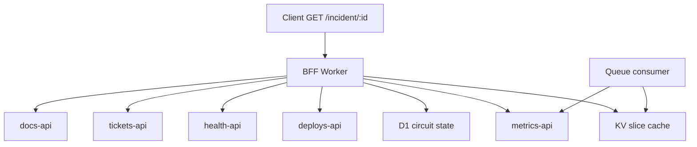

# Incident BFF — Project Specification

> Fault-tolerant multi-origin aggregation on Cloudflare Workers.  
> Copy this document into the new repo as the source-of-truth for scope, architecture, and quality bar.

---

## What this is

An **incident aggregation gateway** (BFF — backend-for-frontend): one HTTP endpoint merges data from several independent upstream services into a single JSON response for an on-call engineer during a partial outage.

The engineering problem is **not** "call five APIs in parallel at the edge." It is:

- One slow or rate-limited upstream must not block or fail the entire page.
- Without a shared cache, many clients refreshing the same dashboard can **synchronize load** on a capped metrics API (see [Prior art](#prior-art--differentiation)).
- Partial cache, circuit breakers, and background refresh produce a **degraded but usable** response when **any** critical upstream fails — evals include both 1/5 and 2/5 failure scenarios.

This is infrastructure tooling / distributed systems work — comparable in resume signal to a task scheduler, rate limiter, or fan-out proxy, not a CRUD app or AI wrapper.

---

## User story

**Maya**, on-call platform engineer, opens `/incident/INC-4421` during a partial outage.

| Slice | Upstream (mock in repo) | Behavior |
|-------|-------------------------|----------|
| Error rate | `metrics-api` | Rate-limited (e.g. 10 req/s) |
| Recent deploys | `deploys-api` | Fast, reliable |
| Affected regions | `health-api` | Internal-style JSON |
| Open tickets | `tickets-api` | Slow (~300ms+) or timeout |
| Runbook link | `docs-api` | Cacheable for hours |

**Naive approach:** Browser calls five APIs; exposes five API keys; every refresh hits `metrics-api`; one timeout → whole UI fails.

**This project:** Browser calls **one** endpoint. The Worker merges slices, serves cache where valid, skips open circuits, returns `degraded: true` when appropriate.

---

## Litmus test (quality bar)

Delete every framework and product name. The project should still sound like a hard problem:

> Aggregated incident telemetry from five independent services with different rate limits and failure modes; partial-response merge and circuit breakers so one slow upstream does not fail the whole page; measured latency and pass rate under partial origin failure versus naive fan-out.

If what remains is only "users fetch data from APIs," the implementation has drifted into a tutorial.

**Employer context:** This is a Cloudflare Workers project because you are applying to Cloudflare. That bends the rule "tool chosen for problem, not problem for tool." Mitigation: lead with the merge/fault-tolerance problem in every bullet and interview answer; mention Workers second, with ADRs on **measured** platform constraints (subrequests, cache, queue pacing).

---

## Architecture



### Request path (hot path)

1. Validate `incidentId`; auth if configured.
2. For each origin, check **KV slice** `cache:{origin}:{incidentId}`.
3. On miss (and circuit closed), `fetch` origin; increment **subrequest counter**.
4. On origin error / timeout / 429: update **D1 circuit breaker**; omit or use stale slice.
5. **Merge** available slices into one JSON body.
6. Set headers: `X-Subrequests-Used`, `X-Degraded` (if any slice stale or missing).
7. Log phases to D1 `audit_logs` via `waitUntil`.

### Background path (cold path)

- **Queue consumer** refreshes rate-limited origins (especially `metrics-api`) on a schedule.
- Writes fresh slices to KV so user requests rarely touch the capped API.
- Pattern: [Handle rate limits of external APIs](https://developers.cloudflare.com/queues/tutorials/handle-rate-limits/) (batch size tuned to mock limit).

---

## Core mechanisms (named patterns)

| Pattern | Purpose |
|---------|---------|
| **Partial-response merge** | Return best-effort JSON when some origins fail |
| **Per-origin circuit breaker** | Stop wasted retries/subrequests to known-dead upstream |
| **KV slice cache** | Cache per `(origin, incidentId)` — not all-or-nothing |
| **Stale-while-revalidate** | Serve stale metrics + `degraded: true` under rate limit |
| **Subrequest budget accounting** | Count and expose fetches per incoming request |
| **Queue-paced refresh** | Decouple background ingest from user-facing latency |

---

## Subrequest honesty

Free tier: **50 subrequests per incoming request** (document current limits in ADRs).

Five parallel fetches = 5 subrequests — **fine**. Limits matter when you add retries, pagination, or N+1 enrichment. The project should **measure and test** budget usage, not claim "5 fetches need edge."

---

## Mock upstreams

Implement five upstream routes in the same Worker (or separate worker routes) with scripted behavior:

| Origin | Script |
|--------|--------|
| `metrics-api` | 429 after N requests per minute |
| `deploys-api` | Stable 50ms JSON |
| `health-api` | Stable JSON |
| `tickets-api` | 500 or 5s timeout (toggle via env) |
| `docs-api` | Stable JSON, long cache TTL |

This keeps the repo self-contained — no external API keys required for demo/eval.

---

## Testing (per phase)

Each implementation phase ships **automated acceptance tests** for its spec AC table. Do not defer all testing to Phase 4 — a broken Phase 0 baseline invalidates every later comparison.

| Layer | Location | When |
|-------|----------|------|
| **Phase AC tests** | `spec-driven/phase-N/*.test.ts` | End of each phase; maps 1:1 to that phase's `spec.md` AC rows |
| **Shared helpers** | `spec-driven/phase-N/helpers.ts` | Worker `fetch` wrappers, fixtures |
| **Full eval harness** | `eval/` (Phase 4+) | Cross-phase scenarios, load metrics, CI regression gate |

**Run:**

```bash
npm test                 # all phase AC tests
npm run test:phase-0     # Phase 0 only
npm run test:watch       # vitest watch mode
```

Phase 0 tests use [`@cloudflare/vitest-pool-workers`](https://developers.cloudflare.com/workers/testing/vitest-integration/) — they invoke the Worker in Miniflare (no separate `wrangler dev` required).

**CI gate (target):** `npm test` fails if any AC test fails (binary pass/fail).

---

## Eval harness (Phase 4+, no LLM)

Directory: `eval/`

| File | Role |
|------|------|
| `fixtures/` | JSON responses per origin per scenario |
| `scenarios.json` | incident id → origin behaviors |
| `run-eval.ts` | Hits BFF (local or deployed); scores behavior |
| `README.md` | Pass rates, failures fixed, thresholds |

**Assert (examples):**

- `tickets-api` down → response includes deploys + health; `degraded: true`; not 502.
- `metrics-api` rate-limited → stale cache served; subrequests ≤ threshold.
- Circuit open → no fetch to that origin (verify via mock call counter or header).
- Naive baseline (optional separate route) → 502 on any single failure — compare in README.

**CI:** `npm run eval` is **deterministic** — each scenario is pass/fail. CI fails if **any** scenario fails (binary gate). There is no flaky pass rate unless you add timing-dependent tests (avoid those in CI; use fixed mock delays).

Track **pass rate** in `eval/README.md` over time only as a regression log (e.g. "42/42 scenarios"), not a probabilistic threshold.

### Partial failure semantics (1/5 vs 2/5)

| Failures | Expected behavior |
|----------|-------------------|
| **0/5** | Full response; `degraded: false` |
| **1/5** | Merged response with four slices; missing slice null or omitted; `degraded: true` — **this is the main product requirement** |
| **2/5** | Same pattern; more fields missing — **stress case for evals**, not a special threshold |
| **5/5** (all circuits open, cold cache) | Empty or shell response + `degraded: true`; may 503 if zero usable data — document policy in ADR |

"2/5" in metrics/examples means *prove the merge still works when multiple origins fail*, not *degradation only kicks in at 40% failure*.

---

## Metrics to measure (for resume bullets)

Record in README / D1 aggregates — **do not claim before measuring**:

| Metric | Baseline | Target direction |
|--------|----------|------------------|
| p95 latency (cold cache) | Naive fan-out | Lower with slice cache |
| p95 latency (warm cache) | — | Sub-200ms on mocks |
| Degradation eval scenarios | 0 (naive 502) | All listed scenarios pass |
| Subrequests per request | Naive with retries | ≤8 under test scenarios |
| Cache hit rate | — | Document under load script |

---

## Hypothetical resume bullets

*Replace numbers after you measure.*

- Designed a **partial-response merge** pipeline with per-origin circuit breakers and KV slice cache to aggregate on-call incident data across five upstream services without cascading failure.
- Implemented **subrequest-budget accounting** with fixture evals asserting ≤8 subrequests under retry + pagination scenarios versus 15+ for naive fan-out.
- Built **queue-paced background refresh** matched to a 10 req/s upstream cap so user requests serve stale metrics with `degraded: true` instead of blocking on 429s during incident load.
- Measured **p95 latency** (cold vs warm cache) and **full pass** on degradation evals including 1/5 and 2/5 origin failure; naive parallel fetch returns 502 on any single timeout.

---

## Suggested repo layout

```
/
├── wrangler.toml
├── package.json
├── tsconfig.json
├── migrations/
│   └── 0001_init.sql          # circuit state, audit_logs
├── src/
│   ├── index.ts               # router
│   ├── handlers/
│   │   ├── incident.ts        # GET /incident/:id — merge path
│   │   └── mock/             # mock origin handlers
│   ├── lib/
│   │   ├── merge.ts           # partial merge logic
│   │   ├── circuit.ts         # breaker read/write (D1)
│   │   ├── cache.ts           # KV slice get/set
│   │   ├── subrequests.ts     # budget counter
│   │   └── telemetry.ts
│   └── queue/
│       └── refresh.ts         # consumer: warm metrics slice
├── spec-driven/
│   └── phase-0/
│       ├── spec.md
│       ├── tasks.md
│       ├── helpers.ts
│       ├── ac.test.ts
│       ├── ac-failures.test.ts
│       └── ac-metrics-rate.test.ts
├── vitest.config.mts
├── eval/
│   ├── fixtures/
│   ├── scenarios.json
│   ├── run-eval.ts
│   └── README.md
├── docs/
│   └── ARCHITECTURE.md        # ADRs: stale vs block, DO vs KV, subrequest limits
└── README.md                  # write last: demo URL, metrics, litmus-friendly summary
```

---

## Bindings

| Binding | Use |
|---------|-----|
| **KV** | Per-origin slice cache |
| **D1** | Circuit breaker state, audit logs |
| **Queues** | Background metrics refresh |
| **Workers AI** | Not used |
| **Durable Objects** | Optional later; not required for MVP |

---

## Implementation phases

| Phase | Deliverable |
|-------|-------------|
| **0** | Five mock upstreams + naive merge route (baseline that 502s on failure) + **AC tests** |
| **1** | KV slice cache + partial merge + `degraded` flag + subrequest header + **AC tests** |
| **2** | D1 circuit breakers + skip dead origins + **AC tests** |
| **3** | Queue consumer for metrics refresh + stale-while-revalidate + **AC tests** |
| **4** | `eval/` cross-phase harness + CI gate + measured metrics in README |
| **5** | ADRs + deploy to `*.workers.dev` |

Do not skip Phase 0 — the **naive baseline** is your comparison point for metrics and evals.

---

## Explicit non-goals

- LLM agents, planners, or multi-hop AI
- RAG, Vectorize, Workers AI
- React dashboard (optional single HTML page calling `/incident/:id` is enough)
- "Edge makes it faster" marketing — document what actually improved (cache hits, 429 avoidance, partial failure)

---

## Interview framing

1. **Problem:** Fault-tolerant merge under heterogeneous upstream SLAs.
2. **Hard parts:** Stale vs block tradeoff; circuit flapping; subrequest budget under retry.
3. **What broke:** Document one real failure from dev (e.g. cache stampede, circuit never half-open).
4. **Why Workers:** One sentence — applying to CF; bindings matched cache + queue pacing + subrequest limits you measured.

---

## Prior art & differentiation

**This is not a novel problem.** Well-documented patterns:

| Pattern | References |
|---------|------------|
| **BFF / aggregation** | [Sam Newman — Backends For Frontends](https://samnewman.io/patterns/architectural/bff/); [Steve Kinney — BFF course notes](https://stevekinney.com/courses/enterprise-ui/backends-for-frontends) |
| **Partial failure / graceful degradation** | Newman: wishlist page should not fail when only inventory is down; `Promise.allSettled`-style merge |
| **Circuit breaker** | Netflix Hystrix / resilience4j lineage; standard microservices literature |
| **Thundering herd / cache stampede** | [Wikipedia](https://en.wikipedia.org/wiki/Thundering_herd_problem); [Redis blog](https://redis.io/blog/how-to-tame-the-thundering-herd-problem/) — synchronized refreshes after expiry or rate-limit reset |
| **Partial responses at scale** | [GraphQL partial responses](https://graphql.org/learn/response/) — `data` + `errors`; Apollo Federation subgraph error inclusion |
| **Queue-paced outbound calls** | [Cloudflare Queues rate-limit tutorial](https://developers.cloudflare.com/queues/tutorials/handle-rate-limits/) |

**When the 429 / herd story is realistic:** Not every metrics API will 429 during an incident. It happens when (a) the upstream has a **shared per-tenant or global quota**, (b) many clients **auto-refresh or manually reload** the same dashboard, and (c) there is **no shared cache** between them — classic [thundering herd](https://en.wikipedia.org/wiki/Thundering_herd_problem) / cache stampede, including synchronized retries after rate-limit window reset ([discussion](https://redis.io/blog/how-to-tame-the-thundering-herd-problem/)). Your mocks encode this; do not claim every production observability stack behaves this way.

**Differentiation (what you still build):**

| Generic tutorial | This repo |
|------------------|-----------|
| `Promise.allSettled` demo | **Naive baseline route** + measured comparison |
| Monolithic response cache | **Per-origin KV slices** + stale-while-revalidate per slice |
| Circuit breaker in memory | Breaker state in **D1** + eval-verified skip behavior |
| "BFF on Express" | **Workers subrequest budget** documented and tested |
| Rate limit "handled" | **Queue batch size** tuned to mock limit with ADR |
| No tests | **Fixture eval suite** in CI (binary pass/fail) |

You are not inventing the BFF. You are **implementing a known resilience policy under Workers constraints with evidence** — same bar as a strong portfolio piece that applies standard methods to a hard problem without claiming novelty in the method itself.

---

## Related references

- [Aggregate requests](https://developers.cloudflare.com/workers/examples/aggregate-requests/)
- [Queues: handle rate limits](https://developers.cloudflare.com/queues/tutorials/handle-rate-limits/)
- [Cache API](https://developers.cloudflare.com/workers/examples/cache-api/)

---

## What this repo is not

The sibling repo `cloudflare-workers-doc-search-qa` was a linear RAG pipeline — generic chunk → embed → search → LLM. This project replaces that portfolio direction with systems engineering that survives the litmus test above.
