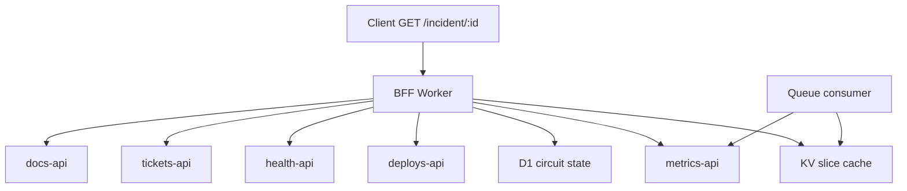

# Incident BFF

Fault-tolerant incident aggregation on [Cloudflare Workers](https://developers.cloudflare.com/workers/). A single HTTP endpoint merges dashboard data from five independent upstream services so an on-call engineer gets a usable response during a partial outage.

---

## Problem

During an incident, an engineer needs error rates, recent deploys, region health, open tickets, and runbook links in one view. Those slices live in separate services with different latency, rate limits, and failure modes.

A naive approach — fan out to every API on every page load — fails the whole dashboard when one upstream times out, and can stampede a rate-limited metrics API when many clients refresh at once.

This BFF aggregates slices at the edge: partial merge when origins fail, per-origin KV caching, circuit breakers, and queue-paced background refresh (phased rollout below).

---

## User story

**Maya**, on-call platform engineer, opens `/incident/INC-4421` during a partial outage.

| Slice | Upstream (mock in repo) | Behavior |
|-------|-------------------------|----------|
| Error rate | `metrics-api` | Rate-limited (10 req/min rolling window) |
| Recent deploys | `deploys-api` | Fast, reliable (~50ms) |
| Affected regions | `health-api` | Stable JSON |
| Open tickets | `tickets-api` | Slow (~300ms) or configurable failure |
| Runbook link | `docs-api` | Stable JSON, long cache TTL |

The browser calls **one** endpoint. The Worker merges slices, serves cache where valid, skips open circuits, and returns `degraded: true` when any slice is missing or stale.

---

## Current status

| Phase | Status | Deliverable |
|-------|--------|-------------|
| **0** | Done | Five mock upstreams, naive merge baseline (`/incident/:id/naive`), acceptance tests |
| **1** | Done | KV slice cache, partial merge on `/incident/:id`, `degraded` flag, subrequest header |
| **2** | Done | D1 circuit breakers, skip open origins, `X-Circuits-Open` header |
| **3** | Planned | Queue-paced metrics refresh, stale-while-revalidate |
| **4** | Planned | Cross-phase eval harness, CI gate |
| **5** | Planned | ADRs, production deploy |

Phase specs and task lists live under `spec-driven/phase-N/`.

---

## Architecture



**Hot path (request):** validate incident ID → read KV slice per origin → fetch on miss → merge available slices → return JSON with `degraded` and `X-Subrequests-Used`.

**Cold path (background):** queue consumer refreshes rate-limited origins and writes fresh slices to KV.

---

## API (Phase 0)

| Method | Path | Description |
|--------|------|-------------|
| `GET` | `/health` | Liveness check |
| `GET` | `/incident/:incidentId/naive` | Naive merge — 502 if any origin fails |
| `GET` | `/incident/:incidentId` | Smart merge — partial failure, KV cache |
| `GET` | `/mock/{origin}/:incidentId` | Mock upstream (same Worker) |

Incident IDs must match `INC-[A-Za-z0-9]+` (e.g. `INC-4421`).

---

## Getting started

**Prerequisites:** Node.js ≥ 18, npm, [Wrangler](https://developers.cloudflare.com/workers/wrangler/).

```bash
npm install
npm run dev          # local Worker at http://localhost:8787
npm run typecheck
npm test             # all acceptance tests
npm run test:phase-0 # Phase 0 only
npm run test:phase-1 # Phase 1 only
npm run test:phase-2 # Phase 2 only
```

Example:

```bash
curl http://localhost:8787/incident/INC-4421/naive
curl http://localhost:8787/health
```

Copy `.dev.vars.example` to `.dev.vars` to override `TICKETS_MODE` or `METRICS_RATE_LIMIT` locally.

Tests use [`@cloudflare/vitest-pool-workers`](https://developers.cloudflare.com/workers/testing/vitest-integration/) — no separate `wrangler dev` process required.

---

## Testing

Acceptance tests map 1:1 to each phase's `spec-driven/phase-N/spec.md` AC table.

| Layer | Location |
|-------|----------|
| Phase AC tests | `tests/phase-N/*.test.ts` |
| Shared helpers | `tests/phase-N/helpers.ts` |
| Phase specs | `spec-driven/phase-N/spec.md`, `tasks.md` |

```bash
npm test                 # all phase tests
npm run test:phase-0     # Phase 0 (7 tests)
npm run test:phase-1     # Phase 1 (8 tests)
npm run test:phase-2     # Phase 2 (6 tests)
npm run test:watch       # watch mode
```

---

## Repo layout

```
/
├── wrangler.toml
├── package.json
├── tsconfig.json
├── vitest.config.mts
├── worker-configuration.d.ts
├── src/
│   ├── index.ts                 # router
│   ├── handlers/
│   │   ├── incident.ts           # GET /incident/:id — smart merge
│   │   ├── incident-naive.ts     # GET /incident/:id/naive
│   │   └── mock/                 # mock upstream handlers
│   │       ├── metrics.ts
│   │       ├── deploys.ts
│   │       ├── health.ts
│   │       ├── tickets.ts
│   │       └── docs.ts
│   └── lib/
│       ├── origins.ts            # types, paths, origin list
│       ├── fixtures.ts           # static JSON payloads
│       ├── cache.ts              # KV slice get/put
│       ├── circuit.ts            # D1 circuit breaker
│       ├── merge.ts              # partial merge + degraded flag
│       ├── subrequests.ts        # subrequest counter
│       ├── mock-call-count.ts    # mock handler call counters
│       └── upstream-fetch.ts     # shared origin fetch helpers
├── migrations/
│   └── 0001_circuit_state.sql
├── tests/
│   ├── apply-migrations.ts       # D1 schema for vitest
│   ├── phase-0/
│   │   ├── helpers.ts
│   │   ├── ac.test.ts
│   │   ├── ac-failures.test.ts
│   │   └── ac-metrics-rate.test.ts
│   ├── phase-1/
│   │   ├── helpers.ts
│   │   ├── ac.test.ts
│   │   ├── ac-failures.test.ts
│   │   ├── ac-cache.test.ts
│   │   └── ac-metrics-rate.test.ts
│   └── phase-2/
│       ├── helpers.ts
│       ├── ac.test.ts
│       ├── ac-circuit.test.ts
│       └── ac-failures.test.ts
└── spec-driven/
    ├── phase-0/
    │   ├── spec.md
    │   ├── tasks.md
    │   └── verify.md
    ├── phase-1/
    │   ├── spec.md
    │   └── tasks.md
    └── phase-2/
        ├── spec.md
        └── tasks.md
```

Planned additions (later phases): `src/queue/`, `eval/`, `docs/`.

---

## Cloudflare bindings

| Binding | Use |
|---------|-----|
| **KV** | Per-origin slice cache (`SLICE_CACHE`) |
| **D1** | Circuit breaker state (`DB`) |
| **Queues** | Background metrics refresh (Phase 3+) |
| **SELF** | Same-worker subrequests to mock upstreams |

---

## References

- [Aggregate requests (Workers)](https://developers.cloudflare.com/workers/examples/aggregate-requests/)
- [Queues: handle rate limits](https://developers.cloudflare.com/queues/tutorials/handle-rate-limits/)
- [Workers KV](https://developers.cloudflare.com/kv/)
- [Sam Newman — Backends For Frontends](https://samnewman.io/patterns/architectural/bff/)
