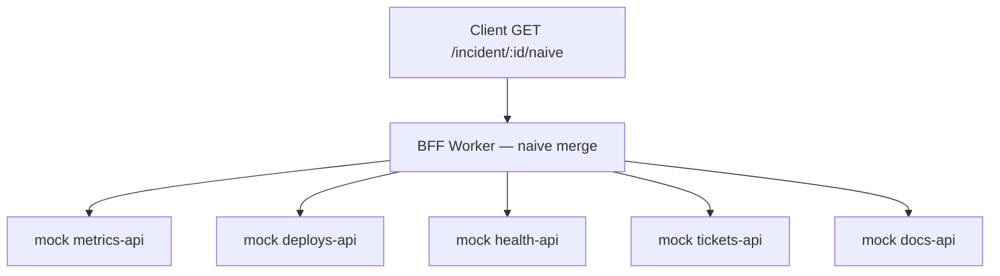

# Phase 0 — Naive baseline

> **Status:** Ready for implementation  
> **Parent spec:** [`README.md`](../../README.md) (project source of truth)  
> **Goal:** Self-contained Worker with five scripted mock upstreams and a fragile BFF that 502s when any origin fails. This is the comparison baseline for later phases — not the product.

---

## Purpose

Phase 0 proves the **naive failure mode** the smart BFF must beat:

- Browser (or eval) calls **one** endpoint: `GET /incident/:incidentId/naive`.
- BFF fan-outs to **five mock upstreams in parallel**.
- If **any** upstream errors, times out, or returns an unacceptable status → entire response is **502**.
- No graceful degradation, no shared cache, no circuit breakers, no queues.

**Why keep it:** README metrics and Phase 4 evals compare smart BFF vs this baseline (latency, 502 rate, subrequests).

**Litmus check:** Phase 0 should sound like “parallel fetch aggregation,” not yet like “fault-tolerant merge under heterogeneous SLAs.” That arrives in Phase 1+.

---

## Scope

### In scope

| Area | Phase 0 behavior |
|------|------------------|
| Cloudflare Worker | Single Worker, TypeScript, `wrangler dev` / deploy |
| Router | Route HTTP paths to mock upstreams or incident handler |
| 5 mock upstreams | Scripted behaviors per README table |
| Naive incident route | `GET /incident/:incidentId/naive` — parallel fetch, all-or-nothing |
| Merged JSON shape | Stable contract for later phases (slice field names fixed here) |
| Env toggles | Minimal vars for mock behavior (e.g. tickets failure mode) |
| Local manual verification | Document curl examples in phase README or comments |

### Out of scope (defer to later phases)

| Feature | Phase |
|---------|-------|
| KV slice cache | 1 |
| `degraded` flag / partial merge / `Promise.allSettled` | 1 |
| `X-Subrequests-Used` header | 1 |
| D1 (circuit breakers, audit logs) | 2 |
| Queues / cron producer / consumer | 3 |
| Stale-while-revalidate | 3 |
| `eval/` harness + CI | 4 |
| ADRs, deployed metrics, auth | 4–5 |

**Explicit:** Phase 0 must **not** add KV, D1, or Queue bindings to `wrangler.toml`.

---

## Architecture (Phase 0 only)



**Request flow:**

1. Validate `incidentId` (non-empty; allow alphanumeric + hyphen pattern e.g. `INC-4421`).
2. Build five internal URLs to mock upstream routes (same Worker origin).
3. `Promise.all` five `fetch` calls with per-origin timeout (see defaults below).
4. If **any** fetch throws, times out, or returns status outside 2xx → **502** with error body.
5. If all succeed → parse JSON from each, merge into response body, **200**.

Bare `GET /incident/:incidentId` (without `/naive`) is **not registered** in Phase 0 — returns **404**.

No auth in Phase 0 unless explicitly added later.

---

## HTTP routes

### Incident BFF (naive)

| Method | Path | Handler |
|--------|------|---------|
| `GET` | `/incident/:incidentId/naive` | Naive merge (Phase 0 baseline) |
| `GET` | `/incident/:incidentId` | **Not registered** — 404 until Phase 1 smart handler |

**Phase 1 note:** Smart partial merge lands on `/incident/:incidentId`; naive baseline stays at `/naive` for comparison.

### Mock upstreams

Implement as routes on the **same Worker** (recommended for self-contained demo):

| Origin | Path | Notes |
|--------|------|-------|
| `metrics-api` | `/mock/metrics-api/:incidentId` | Rate limit via in-memory counter |
| `deploys-api` | `/mock/deploys-api/:incidentId` | ~50ms delay |
| `health-api` | `/mock/health-api/:incidentId` | Stable JSON |
| `tickets-api` | `/mock/tickets-api/:incidentId` | Failure mode from env |
| `docs-api` | `/mock/docs-api/:incidentId` | Stable JSON |

Mock routes use prefix **`/mock/`** (resolved).

BFF calls these via `new URL(..., request.url)` or configured `MOCK_BASE_URL` for local vs deployed (default: same-origin relative paths).

### Health route

| Method | Path | Handler |
|--------|------|---------|
| `GET` | `/health` | `{ "ok": true }` (required) |

---

## Mock upstream behaviors

| Origin | Script | Default parameters |
|--------|--------|-------------------|
| `metrics-api` | Return **429** after **N** requests per rolling **60s** window (per isolate) | `METRICS_RATE_LIMIT=10` per minute |
| `deploys-api` | **200**, JSON fixture, **~50ms** artificial delay | fixed |
| `health-api` | **200**, JSON fixture, minimal delay | fixed |
| `tickets-api` | Mode from env: **`ok`** (200, ~300ms delay), **`500`**, or **`timeout`** (hang > BFF timeout) | `TICKETS_MODE=ok` |
| `docs-api` | **200**, JSON fixture (runbook link) | fixed |

**Rate limit implementation note:** In-memory counter with rolling 60s window per isolate is sufficient for Phase 0 (good enough for local demo). Global rate limit accuracy is not required until eval harness.

**Optional:** `X-Mock-Call-Count` response header on mocks for debugging (not required Phase 0).

---

## Response contract

### Success — `200 OK`

```json
{
  "incidentId": "INC-4421",
  "metrics": { "errorRate": 0.042, "window": "5m" },
  "deploys": { "recent": [{ "id": "d-1", "service": "api", "at": "2026-06-08T12:00:00Z" }] },
  "health": { "regions": [{ "id": "us-east", "status": "degraded" }] },
  "tickets": { "open": [{ "id": "T-99", "title": "Elevated errors" }] },
  "docs": { "runbookUrl": "https://example.com/runbooks/incident" }
}
```

- Field names are **stable** — later phases merge into the same shape.
- Fixture content may be static per origin; **must** include `incidentId` in upstream JSON or BFF injects it for traceability.

### Failure — naive `502 Bad Gateway`

When any origin fails:

```json
{
  "error": "upstream_failure",
  "incidentId": "INC-4421",
  "failedOrigin": "tickets-api"
}
```

- `failedOrigin` identifies the **first** failing origin only.
- Deferred: CLI flag to report all failures (Phase 4+ eval tooling; out of Phase 0 scope).
- **No** `degraded` field in Phase 0.

---

## Fetch / timeout defaults

| Setting | Default | Notes |
|---------|---------|-------|
| Per-upstream fetch timeout | **5s** | Ensures tickets timeout mode triggers 502 |
| Parallelism | `Promise.all` | Intentionally fragile |
| Retries | **0** | Retries deferred to later phases |

---

## Environment variables

| Variable | Default | Purpose |
|----------|---------|---------|
| `TICKETS_MODE` | `ok` | `ok` \| `500` \| `timeout` |
| `METRICS_RATE_LIMIT` | `10` | Max successful responses per 60s before 429 |
| `MOCK_BASE_URL` | *(empty = same origin)* | Override for tests calling deployed worker |

No secrets required Phase 0.

---

## Files to add (append to repo)

Aligns with README suggested layout; Phase 0 subset only:

```
/
├── wrangler.toml
├── package.json
├── tsconfig.json
├── src/
│   ├── index.ts                    # router
│   ├── handlers/
│   │   ├── incident-naive.ts       # GET /incident/:id/naive
│   │   └── mock/
│   │       ├── metrics.ts
│   │       ├── deploys.ts
│   │       ├── health.ts
│   │       ├── tickets.ts
│   │       └── docs.ts
│   └── lib/
│       ├── origins.ts              # origin names, paths, types
│       └── fixtures.ts             # static JSON payloads
└── spec-driven/
    └── phase-0/
        ├── spec.md                 # this file
        └── tasks.md
```

**Not created Phase 0:** `migrations/`, `eval/`, `src/lib/merge.ts`, `src/queue/`, KV/D1/Queue bindings.

---

## Acceptance criteria

Automated tests in `tests/phase-0/*.test.ts` (run via `npm run test:phase-0`). Manual curls in [`verify.md`](./verify.md).

| # | Scenario | Expected | Test file |
|---|----------|----------|-----------|
| AC-1 | `TICKETS_MODE=ok`, all origins reachable | `GET /incident/INC-4421/naive` → **200**, body has all five slice keys | `ac.test.ts` |
| AC-2 | `TICKETS_MODE=500` | **502**, `failedOrigin` includes `tickets-api` | `ac-failures.test.ts` |
| AC-3 | `TICKETS_MODE=timeout` | **502** (tickets exceeds BFF timeout) | `ac-failures.test.ts` |
| AC-4 | Burst `metrics-api` > N/min | Metrics returns **429** → incident route **502** | `ac-metrics-rate.test.ts` |
| AC-5 | Each mock route directly | Returns expected status/delay in isolation | `ac.test.ts` |
| AC-6 | Invalid `incidentId` (empty / bad pattern) | **400** on `/incident/BAD/naive` | `ac.test.ts` |
| AC-7 | Bare incident path (no `/naive`) | `GET /incident/INC-4421` → **404** | `ac.test.ts` |

---

## Resolved decisions

| Decision | Resolution |
|----------|------------|
| Mock path prefix | `/mock/` |
| 502 body | First `failedOrigin` only (all-failures CLI flag deferred to Phase 4+) |
| Incident route | `GET /incident/:incidentId/naive` (Phase 1 smart merge uses `/incident/:incidentId`) |
| Metrics rate window | Rolling 60s in-memory per isolate |
| Health route | `GET /health` required |

---

## References

- [README — Phase 0](../../README.md#implementation-phases)
- [README — Mock upstreams](../../README.md#mock-upstreams)
- [Cloudflare Workers — Aggregate requests](https://developers.cloudflare.com/workers/examples/aggregate-requests/)
