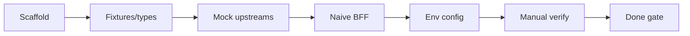

# Phase 0 — Tasks

> **Spec:** [`spec.md`](./spec.md)  
> **Order:** Top to bottom. Check off as completed during implementation.

---

## 0. Prerequisites

### Resolved decisions (locked)

| Decision | Resolution |
|----------|------------|
| Mock path prefix | `/mock/` |
| 502 body | `failedOrigin` — **first failure only** (report all failures via CLI flag deferred to Phase 4+) |
| Incident route | **`GET /incident/:incidentId/naive`** (Phase 1 smart merge uses `/incident/:incidentId`) |
| Metrics rate window | Rolling **60s** in-memory per isolate |
| Health route | **`GET /health`** required |

- [x] **T0.1** Node.js ≥ 18 and npm available locally.

---

## 1. Project scaffold

- [x] **T1.1** Initialize Worker project: `package.json`, `tsconfig.json`, `wrangler.toml` (Workers script, compatibility date, **no** KV/D1/Queue bindings).
- [x] **T1.2** Add npm scripts: `dev` (`wrangler dev`), `deploy` (`wrangler deploy`), `typecheck` (`tsc --noEmit`).
- [x] **T1.3** Add `src/index.ts` entry: export default `{ fetch }` handler skeleton.
- [x] **T1.4** Add **`GET /health`** → `{ "ok": true }` (required).

---

## 2. Shared types and fixtures

- [x] **T2.1** Create `src/lib/origins.ts`: origin id constants, mock path builder under **`/mock/{origin}/:incidentId`**, ordered list of five origins.
- [x] **T2.2** Create `src/lib/fixtures.ts`: static JSON per origin (metrics, deploys, health, tickets, docs); include plausible incident-dashboard fields.
- [x] **T2.3** Define TypeScript types for merged incident response and upstream slice shapes (used by handler and mocks).

---

## 3. Mock upstream handlers

One module per origin under `src/handlers/mock/`. Each exports a handler `(request, env, incidentId) => Response`.

- [x] **T3.1** **metrics-api** — in-memory rate counter with **rolling 60s window per isolate**; return 429 when over `METRICS_RATE_LIMIT`; else 200 + fixture.
- [x] **T3.2** **deploys-api** — await ~50ms; return 200 + fixture.
- [x] **T3.3** **health-api** — return 200 + fixture (internal-style regions payload).
- [x] **T3.4** **tickets-api** — read `TICKETS_MODE`: `ok` (~300ms + 200), `500` (500 + error body), `timeout` (delay > BFF timeout, no response within window).
- [x] **T3.5** **docs-api** — return 200 + fixture with `runbookUrl`.
- [x] **T3.6** Wire router in `index.ts` to dispatch **`GET /mock/{origin}/:incidentId`** to the correct handler.
- [x] **T3.7** Manual test: curl each mock route in isolation (AC-5).

---

## 4. Naive incident BFF handler

- [x] **T4.1** Create `src/handlers/incident-naive.ts`.
- [x] **T4.2** Validate `incidentId` path param → 400 if missing/invalid pattern.
- [x] **T4.3** Build five same-origin fetch URLs from `origins.ts` + incoming request URL (respect optional `MOCK_BASE_URL`).
- [x] **T4.4** Implement parallel fetch with `Promise.all`, 5s timeout per origin, **no retries**.
- [x] **T4.5** On any non-2xx, throw, or timeout → **502** with `{ error, incidentId, failedOrigin }` where `failedOrigin` is the **first** failure only (all-failures CLI flag deferred).
- [x] **T4.6** On all success → merge JSON into stable response shape → **200**.
- [x] **T4.7** Wire **`GET /incident/:incidentId/naive`** in `index.ts` to naive handler.
- [x] **T4.8** Return 404 for unknown routes.
- [x] **T4.9** Ensure **`GET /incident/:incidentId`** (without `/naive`) is **not** registered — returns 404 until Phase 1 smart handler.

---

## 5. Environment and configuration

- [x] **T5.1** Add `.dev.vars.example`: `TICKETS_MODE`, `METRICS_RATE_LIMIT`, optional `MOCK_BASE_URL`.
- [x] **T5.2** Extend `Env` interface in Worker types for optional string env bindings.

---

## 6. Verification (manual)

Run `npm run dev` and confirm acceptance criteria. Use **`/incident/INC-4421/naive`** for incident route tests.

- [x] **T6.1** AC-1 — `TICKETS_MODE=ok`, `GET /incident/INC-4421/naive` → **200**, five slice keys present.
- [x] **T6.2** AC-2 — `TICKETS_MODE=500` → **502**, `failedOrigin: tickets-api`.
- [x] **T6.3** AC-3 — `TICKETS_MODE=timeout` → **502**.
- [x] **T6.4** AC-4 — burst `/mock/metrics-api/...` past limit → incident route **502**.
- [x] **T6.5** AC-6 — bad `incidentId` on `/incident/BAD/naive` → **400**.
- [x] **T6.6** AC-5 — each `/mock/{origin}/:incidentId` route returns expected status/delay in isolation.
- [x] **T6.7** `GET /incident/INC-4421` (no `/naive`) → **404**.

See [`verify.md`](./verify.md) for curl commands.

---

## 7. Phase 0 done checklist

- [x] **T7.1** No KV, D1, Queue imports or bindings in codebase.
- [x] **T7.2** No `degraded`, `merge.ts`, circuit breaker, or queue consumer code.
- [x] **T7.3** Naive route at **`/incident/:id/naive`** only; bare `/incident/:id` unregistered.
- [x] **T7.4** `npm run typecheck` passes.
- [x] **T7.5** Ready for Phase 1 spec (smart merge on `/incident/:id` + KV) without renaming slice fields.

---

## Dependency graph

---

## Out of scope reminder

Do **not** implement during Phase 0:

- `Promise.allSettled` / partial merge
- KV, D1, Queues, cron, `waitUntil` audit logs
- `eval/run-eval.ts` or CI
- `X-Subrequests-Used` header
- CLI flag for reporting all failed origins in 502 body
