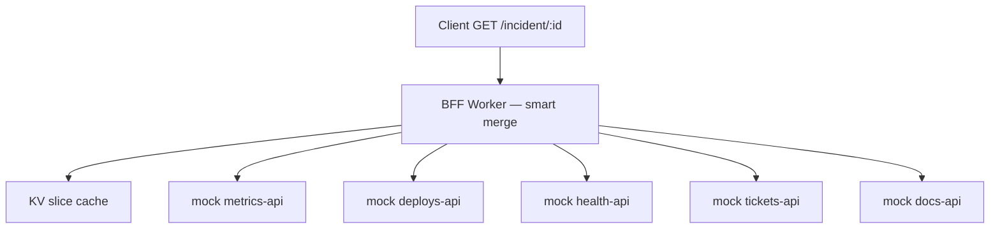

# Phase 1 — Smart merge + KV slice cache

> **Status:** Ready for implementation  
> **Parent spec:** [`README.md`](../../README.md) (project source of truth)  
> **Prerequisite:** Phase 0 complete (naive baseline at `/incident/:id/naive`)  
> **Goal:** Product BFF on `GET /incident/:incidentId` — partial merge when origins fail, per-origin KV slice cache, subrequest accounting.

---

## Purpose

Phase 1 delivers the **core product behavior** the naive baseline cannot:

- One endpoint: `GET /incident/:incidentId` (no `/naive` suffix).
- Fan-out uses **`Promise.allSettled`** — one failing upstream does **not** fail the whole response.
- Missing slices are **`null`**; body includes **`degraded: true`** when any slice is missing.
- Successful origin payloads are cached in **KV per `(origin, incidentId)`** so repeat requests avoid redundant subrequests.
- Response exposes **`X-Subrequests-Used`** (and **`X-Degraded`** when degraded) for budget honesty.

**Why keep `/naive`:** Phase 0 route stays unchanged for latency / 502-rate comparison in Phase 4 evals.

**Litmus check:** Phase 1 should sound like “fault-tolerant partial merge with per-origin cache,” not yet “circuit breakers + queue-paced refresh.” Those are Phases 2–3.

---

## Scope

### In scope

| Area | Phase 1 behavior |
|------|------------------|
| Smart incident route | `GET /incident/:incidentId` — partial merge |
| Partial failure | **200** with available slices; failed/missing → `null`; `degraded: true` |
| KV slice cache | Read before fetch; write on successful 2xx fetch |
| Subrequest header | `X-Subrequests-Used: <n>` — counts origin fetches only |
| Degraded signaling | `degraded` in JSON body; `X-Degraded: true` header when degraded |
| Naive baseline | `/incident/:id/naive` unchanged (still 502 on any failure) |
| AC tests | `spec-driven/phase-1/*.test.ts` mapped to AC table below |

### Out of scope (defer to later phases)

| Feature | Phase |
|---------|-------|
| D1 circuit breakers / skip open circuits | 2 |
| Queues / background metrics refresh | 3 |
| Stale-while-revalidate (serve expired KV under 429 while queue warms) | 3 |
| `waitUntil` audit logs | 2+ |
| `eval/` harness + CI regression gate | 4 |
| Auth, ADRs, deploy metrics | 4–5 |

**Explicit:** Phase 1 adds **KV only** — no D1 or Queue bindings in `wrangler.toml`.

---

## Architecture (Phase 1 only)



**Request flow:**

1. Validate `incidentId` (same rules as Phase 0).
2. Initialize subrequest counter at **0**.
3. For each origin (in `ORIGIN_IDS` order):
   1. **KV get** `cache:{origin}:{incidentId}` — does **not** increment subrequest counter.
   2. If entry exists and **fresh** (`cachedAt + ttlSeconds > now`) → use cached slice; skip fetch.
   3. Else (**miss** or **expired**) → **fetch** mock origin via `SELF` / `fetch`; increment counter by **1**.
   4. On fetch **2xx** → parse JSON, **KV put** with metadata, use slice.
   5. On fetch **error / timeout / non-2xx** → slice is **`null`** (do **not** serve expired KV in Phase 1).
4. **Merge** all slice results into response body (stable field names from Phase 0).
5. Set `degraded: true` if **any** slice is `null`; else `degraded: false`.
6. Set headers: `X-Subrequests-Used`, and `X-Degraded: true` when `degraded` is true.
7. If **zero** non-null slices → **503** with error body (see below). Otherwise **200**.

**Parallelism:** Use `Promise.allSettled` (or equivalent) so one slow origin does not reject the whole merge; per-origin logic above runs inside each settled branch.

---

## HTTP routes

### Incident BFF

| Method | Path | Handler | Phase 1 behavior |
|--------|------|---------|-------------------|
| `GET` | `/incident/:incidentId` | Smart merge | **New** — partial merge + KV |
| `GET` | `/incident/:incidentId/naive` | Naive merge | **Unchanged** — Phase 0 baseline |

Mock upstream routes (`/mock/{origin}/:incidentId`) and `GET /health` are **unchanged** from Phase 0.

---

## KV slice cache

### Key format

```
cache:{origin}:{incidentId}
```

Example: `cache:metrics-api:INC-4421`

### Value format

JSON object stored as KV string:

```json
{
  "data": { "errorRate": 0.042, "window": "5m" },
  "cachedAt": 1717840800,
  "ttlSeconds": 60
}
```

- `data` — upstream slice JSON (same shape as Phase 0 fixtures).
- `cachedAt` — Unix seconds when written.
- `ttlSeconds` — freshness window for this origin.

### TTL defaults (env-overridable)

| Origin | Default `ttlSeconds` | Rationale |
|--------|---------------------|-----------|
| `metrics-api` | `60` | Short; rate-limited upstream |
| `deploys-api` | `60` | Incident-time freshness |
| `health-api` | `60` | Incident-time freshness |
| `tickets-api` | `60` | Incident-time freshness |
| `docs-api` | `3600` | Runbook link; long-lived per README |

Optional env: `SLICE_TTL_SECONDS` as global override, or per-origin vars (e.g. `DOCS_SLICE_TTL_SECONDS`) — implementation choice; document in code.

### Fresh vs stale vs missing (Phase 1)

| State | Behavior |
|-------|----------|
| **Fresh hit** | Serve `data` from KV; **no** origin fetch; subrequest counter unchanged for that origin |
| **Miss** | Fetch origin; on 2xx write KV and use slice; on failure → `null` |
| **Expired** | Treat as miss — refetch; on failure → `null` (**do not** serve expired KV in Phase 1) |

Phase 3 adds stale-while-revalidate (serve expired under 429 + queue refresh). Phase 1 only uses **fresh** KV hits.

### Binding

```toml
[[kv_namespaces]]
binding = "SLICE_CACHE"
id = "<production-id>"
preview_id = "<preview-id>"
```

Vitest pool workers emulates KV in tests via the same `wrangler.toml` binding.

---

## Response contract

### Success — `200 OK` (full or partial)

All five slice keys are **always present**; failed origins map to **`null`**:

```json
{
  "incidentId": "INC-4421",
  "degraded": true,
  "metrics": { "errorRate": 0.042, "window": "5m" },
  "deploys": { "recent": [{ "id": "d-1", "service": "api", "at": "2026-06-08T12:00:00Z" }] },
  "health": { "regions": [{ "id": "us-east", "status": "degraded" }] },
  "tickets": null,
  "docs": { "runbookUrl": "https://example.com/runbooks/incident" }
}
```

- `degraded: false` when all five slices are non-null.
- `degraded: true` when **any** slice is `null`.
- Slice field names unchanged from Phase 0 (`metrics`, `deploys`, `health`, `tickets`, `docs`).

### No usable data — `503 Service Unavailable`

When **all five** slices are `null` (cold cache, every origin failed):

```json
{
  "error": "no_data",
  "incidentId": "INC-4421",
  "degraded": true
}
```

### Validation — `400 Bad Request`

Same as Phase 0: invalid `incidentId` → `{ "error": "invalid_incident_id", incidentId }`.

### Response headers

| Header | When | Value |
|--------|------|-------|
| `X-Subrequests-Used` | Always on smart route | Non-negative integer; origin fetches only (not KV ops) |
| `X-Degraded` | `degraded: true` | `true` |

Omit `X-Degraded` when `degraded: false` (or set `false` — pick one; **recommended: omit when false**).

---

## Partial failure semantics (Phase 1)

Aligns with README eval intent; Phase 1 proves the **1/5** case without circuits or queues.

| Failures | Expected (smart route) | Naive route (unchanged) |
|----------|------------------------|-------------------------|
| **0/5** | 200, all slices, `degraded: false`, `X-Subrequests-Used: 5` on cold cache | 200 |
| **1/5** | 200, four slices + one `null`, `degraded: true` | **502** |
| **2/5** | 200, three slices + two `null`, `degraded: true` | **502** |
| **5/5** (cold cache) | **503** `no_data` | **502** (first `failedOrigin`) |

---

## Fetch / timeout defaults

Inherited from Phase 0 — no change:

| Setting | Default |
|---------|---------|
| Per-upstream fetch timeout | **5s** |
| Retries | **0** |
| Parallelism | `Promise.allSettled` over origins |

---

## Environment variables

Phase 0 vars unchanged. Phase 1 additions (optional):

| Variable | Default | Purpose |
|----------|---------|---------|
| `SLICE_TTL_SECONDS` | *(unset)* | Optional global TTL override for all origins |
| `DOCS_SLICE_TTL_SECONDS` | `3600` | Docs slice TTL |

`TICKETS_MODE`, `METRICS_RATE_LIMIT`, `MOCK_BASE_URL`, `SELF` binding — same as Phase 0.

---

## Files to add or change

```
/
├── wrangler.toml                          # add SLICE_CACHE KV binding
├── worker-configuration.d.ts              # SLICE_CACHE on Env
├── package.json                           # test:phase-1 script
├── src/
│   ├── index.ts                           # route GET /incident/:id → smart handler
│   ├── handlers/
│   │   ├── incident.ts                    # smart merge handler
│   │   └── incident-naive.ts              # unchanged behavior
│   └── lib/
│       ├── cache.ts                       # KV get/put, freshness check
│       ├── merge.ts                       # partial merge + degraded flag
│       ├── subrequests.ts                 # counter helper
│       └── origins.ts                     # extend types (PartialIncidentResponse)
└── spec-driven/
    └── phase-1/
        ├── spec.md                        # this file
        ├── tasks.md
        ├── helpers.ts
        ├── ac.test.ts
        ├── ac-failures.test.ts
        ├── ac-cache.test.ts
        ├── ac-metrics-rate.test.ts
        └── verify.md                      # optional manual curls
```

**Not created Phase 1:** `migrations/`, `src/lib/circuit.ts`, `src/queue/`, D1/Queue bindings.

---

## Acceptance criteria

Automated tests in `spec-driven/phase-1/*.test.ts` (run via `npm run test:phase-1`). Phase 0 tests must still pass (`npm run test:phase-0`).

| # | Scenario | Expected | Test file |
|---|----------|----------|-----------|
| AC-1 | `TICKETS_MODE=ok`, cold cache | `GET /incident/INC-4421` → **200**, all five slices non-null, `degraded: false`, `X-Subrequests-Used: 5` | `ac.test.ts` |
| AC-2 | `TICKETS_MODE=500` (via `X-Tickets-Mode` header), cold cache | **200**, `tickets: null`, other four slices present, `degraded: true`, `X-Degraded: true` | `ac-failures.test.ts` |
| AC-3 | `TICKETS_MODE=timeout`, cold cache | **200**, `tickets: null`, `degraded: true` (not 502) | `ac-failures.test.ts` |
| AC-4 | Burst `metrics-api` past limit, cold cache | Smart route **200**, `metrics: null`, `degraded: true` (naive route still **502**) | `ac-metrics-rate.test.ts` |
| AC-5 | Warm cache — two sequential smart requests, all origins ok | Second response **200**, `degraded: false`, `X-Subrequests-Used: 0` | `ac-cache.test.ts` |
| AC-6 | Invalid `incidentId` | **400** on `/incident/BAD` | `ac.test.ts` |
| AC-7 | Naive baseline regression | `/incident/INC-4421/naive` with `X-Tickets-Mode: 500` still **502** | `ac-failures.test.ts` |
| AC-8 | Two origin failures (e.g. tickets 500 + metrics rate-limited), cold cache | **200**, two `null` slices, `degraded: true`, at least one non-null slice | `ac-failures.test.ts` |

---

## Resolved decisions

| Decision | Resolution |
|----------|------------|
| Smart route path | `GET /incident/:incidentId` (naive stays at `/naive`) |
| Missing slice representation | **`null`** (all five keys always present) |
| Expired KV on fetch failure | **Do not serve** — omit as `null` until Phase 3 SWR |
| KV key | `cache:{origin}:{incidentId}` |
| KV binding name | `SLICE_CACHE` |
| Subrequest counting | Origin `fetch` / `SELF.fetch` only; KV get/put excluded |
| All origins fail (cold) | **503** `no_data` |
| `X-Degraded` | Present when `degraded: true`; omit when false |
| Partial merge primitive | `Promise.allSettled` |

---

## References

- [Phase 0 spec](../phase-0/spec.md)
- [README — Phase 1](../../README.md#implementation-phases)
- [README — Partial failure semantics](../../README.md#partial-failure-semantics-15-vs-25)
- [Cloudflare Workers KV](https://developers.cloudflare.com/kv/)
