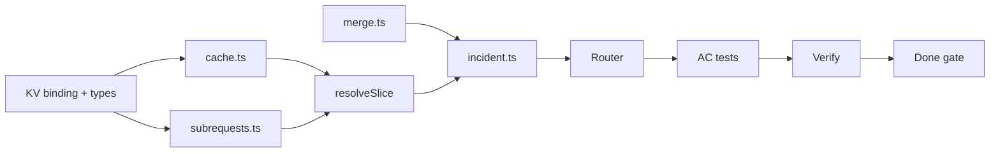

# Phase 1 — Tasks

> **Spec:** [`spec.md`](./spec.md)  
> **Prerequisite:** Phase 0 complete (`npm run test:phase-0` passes)  
> **Order:** Top to bottom. Check off as completed during implementation.

---

## 0. Prerequisites

### Resolved decisions (locked)

| Decision | Resolution |
|----------|------------|
| Smart route | **`GET /incident/:incidentId`** |
| Naive baseline | **`GET /incident/:incidentId/naive`** — unchanged |
| Missing slices | **`null`** with all five keys present |
| KV key | `cache:{origin}:{incidentId}` |
| KV binding | **`SLICE_CACHE`** |
| Expired cache on failure | **Do not serve** (Phase 3 SWR) |
| All origins fail (cold) | **503** `{ error: "no_data", incidentId, degraded: true }` |
| Subrequests | Count origin fetches only; expose **`X-Subrequests-Used`** |
| Degraded | Body **`degraded`** + header **`X-Degraded: true`** when any slice null |

- [ ] **T0.1** Confirm Phase 0 tests pass: `npm run test:phase-0`.

---

## 1. KV binding and types

- [ ] **T1.1** Add `[[kv_namespaces]]` binding `SLICE_CACHE` to `wrangler.toml` (use preview id for local/test).
- [ ] **T1.2** Extend `Env` in `worker-configuration.d.ts` with `SLICE_CACHE: KVNamespace`.
- [ ] **T1.3** Add `PartialIncidentResponse` type in `src/lib/origins.ts`: same slice keys as `IncidentResponse`, each slice `T | null`, plus `degraded: boolean`.
- [ ] **T1.4** Add `NoDataErrorResponse` type for 503 body.

---

## 2. Cache module (`src/lib/cache.ts`)

- [ ] **T2.1** Implement `cacheKey(origin, incidentId)` → `cache:{origin}:{incidentId}`.
- [ ] **T2.2** Define `CachedSlice` value shape: `{ data, cachedAt, ttlSeconds }`.
- [ ] **T2.3** Implement `getFreshSlice(env, origin, incidentId)` → cached `data` or `null` if miss/expired.
- [ ] **T2.4** Implement `putSlice(env, origin, incidentId, data, ttlSeconds)` — set `cachedAt` to now.
- [ ] **T2.5** Implement `ttlForOrigin(env, origin)` — defaults per spec table (`docs-api` → 3600, others → 60).

---

## 3. Subrequest counter (`src/lib/subrequests.ts`)

- [ ] **T3.1** Small counter type or closure: `createSubrequestCounter()` with `increment()`, `value()`.
- [ ] **T3.2** Document: only origin fetches increment; KV operations do not.

---

## 4. Merge module (`src/lib/merge.ts`)

- [ ] **T4.1** Define per-origin result type: `{ origin, slice: unknown | null }`.
- [ ] **T4.2** Implement `mergeSlices(incidentId, results)` → `PartialIncidentResponse` with `degraded` derived from any `null` slice.
- [ ] **T4.3** Implement `hasAnySlice(response)` helper for 503 vs 200 decision.

---

## 5. Origin fetch orchestration

Extract or share fetch logic from `incident-naive.ts` where sensible (avoid duplication of timeout / `SELF` / URL building).

- [ ] **T5.1** Implement `resolveSlice(env, request, origin, incidentId, counter)`:
  - Try `getFreshSlice` → return data on hit.
  - On miss/expired: fetch mock URL with 5s timeout; `counter.increment()`.
  - On 2xx: `putSlice`, return data.
  - On failure: return `null`.
- [ ] **T5.2** Run `ORIGIN_IDS.map(...)` inside **`Promise.allSettled`**; collect results regardless of per-origin outcome.

---

## 6. Smart incident handler (`src/handlers/incident.ts`)

- [ ] **T6.1** Create `handleIncident(request, env, incidentId)`.
- [ ] **T6.2** Validate `incidentId` → 400 (same as naive).
- [ ] **T6.3** Orchestrate per-origin `resolveSlice` via `Promise.allSettled`.
- [ ] **T6.4** Merge with `mergeSlices`; if no non-null slices → **503** `no_data`.
- [ ] **T6.5** Else → **200** JSON body.
- [ ] **T6.6** Set `X-Subrequests-Used` on every smart response.
- [ ] **T6.7** Set `X-Degraded: true` when `degraded: true`.

---

## 7. Router wiring

- [ ] **T7.1** Register **`GET /incident/:incidentId`** in `src/index.ts` → `handleIncident`.
- [ ] **T7.2** Ensure route order: `/naive` suffix matched before bare `/incident/:id` (or use distinct patterns).
- [ ] **T7.3** Confirm `/incident/:id/naive` still routes to naive handler unchanged.

---

## 8. Phase 1 acceptance tests

Create `spec-driven/phase-1/` test files mirroring Phase 0 structure. Reuse or extend `helpers.ts` (`workerFetch`, `workerJson`).

- [ ] **T8.1** `helpers.ts` — same pattern as Phase 0 (`createExecutionContext`, `SELF` via vitest env).
- [ ] **T8.2** `ac.test.ts` — AC-1 (happy path + headers), AC-6 (invalid id).
- [ ] **T8.3** `ac-failures.test.ts` — AC-2, AC-3, AC-7 (naive regression), AC-8 (two failures).
- [ ] **T8.4** `ac-cache.test.ts` — AC-5 (warm cache, `X-Subrequests-Used: 0` on second request).
- [ ] **T8.5** `ac-metrics-rate.test.ts` — AC-4 (isolated file for rate-limit state); assert smart **200** degraded vs naive **502**.
- [ ] **T8.6** Add `npm run test:phase-1` script to `package.json`.
- [ ] **T8.7** Optional `verify.md` with curl examples for smart route.

---

## 9. Verification

- [ ] **T9.1** `npm run test:phase-1` — all AC rows pass.
- [ ] **T9.2** `npm run test:phase-0` — naive baseline still passes (no regressions).
- [ ] **T9.3** `npm run typecheck` passes.
- [ ] **T9.4** Manual: cold smart request → 5 subrequests; repeat → 0 subrequests.
- [ ] **T9.5** Manual: `X-Tickets-Mode: 500` on smart route → 200 degraded; same on `/naive` → 502.

---

## 10. Phase 1 done checklist

- [ ] **T10.1** `SLICE_CACHE` KV binding present; **no** D1 or Queue bindings.
- [ ] **T10.2** No `circuit.ts`, `queue/`, or D1 imports.
- [ ] **T10.3** Smart merge on `/incident/:id`; naive on `/incident/:id/naive`.
- [ ] **T10.4** `degraded`, `X-Subrequests-Used`, `X-Degraded` implemented per spec.
- [ ] **T10.5** Ready for Phase 2 spec (D1 circuit breakers) without changing slice field names or KV key format.

---

## Dependency graph

---

## Out of scope reminder

Do **not** implement during Phase 1:

- D1 circuit breaker read/write or skipping origins
- Queues, cron, background metrics refresh
- Serving **expired** KV when fetch fails (stale-while-revalidate)
- `waitUntil` audit logging
- `eval/run-eval.ts`
- Changes to naive handler semantics (except shared fetch refactor if needed)
