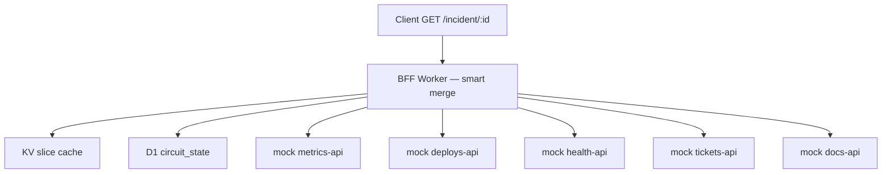
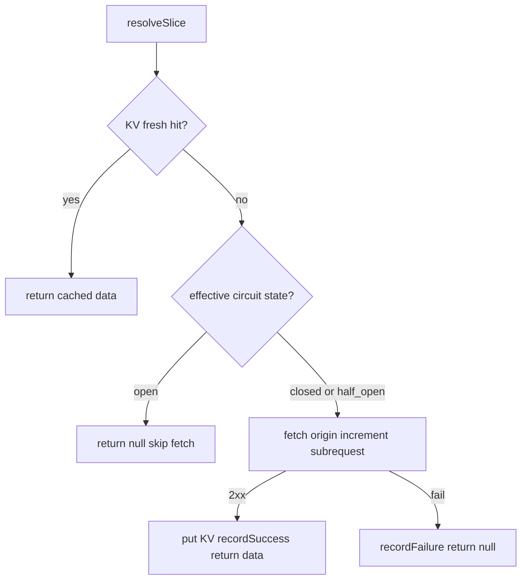

# Phase 2 — D1 circuit breakers

> **Status:** Ready for implementation  
> **Parent spec:** [`master-plan.md`](../../master-plan.md) (full internal plan; local, gitignored). Public overview: [`README.md`](../../README.md).  
> **Prerequisite:** Phase 1 complete (smart merge + KV slice cache; `npm run test:phase-1` passes)  
> **Goal:** Per-origin circuit breakers in D1 on the smart BFF — skip fetches to known-dead upstreams, preserve Phase 1 KV and partial-merge behavior.

---

## Purpose

Phase 2 stops **wasted subrequests** to upstreams that are already failing:

- Circuit state is stored in **D1** (not in-memory) — survives isolate restarts, eval-verifiable.
- **Per-origin** breaker: one sick `tickets-api` does not affect `deploys-api`.
- When a circuit is **open**, the smart route **skips the fetch** (no subrequest counted) and returns `null` for that slice unless a **fresh KV hit** exists.
- **Naive route unchanged** — no circuit logic on `/incident/:id/naive` (baseline comparison).

**Litmus check:** Phase 2 should sound like “skip dead origins with persisted breaker state,” not yet “queue-paced refresh or stale-while-revalidate.” That is Phase 3.

---

## Scope

### In scope

| Area | Phase 2 behavior |
|------|------------------|
| D1 circuit state | `circuit_state` table; binding `DB` |
| State machine | `closed` → `open` → `half_open` → `closed` |
| Trip condition | **3 consecutive failures** per origin (non-2xx, timeout, 429) |
| Open duration | **30s** default; then transition to `half_open` |
| Half-open probe | One allowed fetch; success closes circuit; failure re-opens |
| Smart route integration | Check circuit before fetch in `resolveSlice` |
| Skip open circuit | No fetch, no subrequest increment; slice `null` unless fresh KV |
| Header | `X-Circuits-Open` — comma-separated origins skipped due to open circuit |
| Mock observability | `X-Mock-Call-Count` on mock responses (per-handler counter) |
| AC tests | `tests/phase-2/*.test.ts` mapped to AC table below |

### Out of scope (defer to later phases)

| Feature | Phase |
|---------|-------|
| `audit_logs` table / `waitUntil` telemetry | 4+ |
| Queues / background metrics refresh | 3 |
| Stale-while-revalidate (serve expired KV under 429) | 3 |
| Circuit breaker on naive route | — (never) |
| `eval/` harness + CI regression gate | 4 |
| Auth, ADRs, deploy metrics | 4–5 |

**Explicit:** Phase 2 adds **D1 only** — no Queue bindings. KV (`SLICE_CACHE`) behavior from Phase 1 is unchanged.

---

## Architecture (Phase 2 only)



### Updated `resolveSlice` flow (smart route)

1. **KV get** — if **fresh** hit → return cached `data` (circuit state irrelevant).
2. **Circuit check** (D1) — resolve effective state (`open` may become `half_open` after cooldown).
3. If **open** (not yet eligible for probe) → return `null`, record origin in `X-Circuits-Open` list; **no fetch**.
4. If **closed** or **half_open** → fetch origin; increment subrequest counter.
5. On fetch **2xx** → `putSlice`, `recordSuccess` in D1, return data.
6. On fetch **failure** → `recordFailure` in D1; return `null`.

Phase 1 merge, `degraded`, `503 no_data`, and header rules are unchanged.



---

## HTTP routes

| Method | Path | Handler | Phase 2 change |
|--------|------|---------|----------------|
| `GET` | `/incident/:incidentId` | Smart merge | Circuit check before fetch |
| `GET` | `/incident/:incidentId/naive` | Naive merge | **Unchanged** — no D1, no skip |
| `GET` | `/mock/{origin}/:incidentId` | Mock upstream | Optional `X-Mock-Call-Count` header |
| `GET` | `/health` | Health | Unchanged |

---

## D1 circuit breaker

### Schema

Migration: `migrations/0001_circuit_state.sql`

```sql
CREATE TABLE IF NOT EXISTS circuit_state (
  origin TEXT PRIMARY KEY,
  state TEXT NOT NULL CHECK (state IN ('closed', 'open', 'half_open')),
  failure_count INTEGER NOT NULL DEFAULT 0,
  opened_at INTEGER,
  updated_at INTEGER NOT NULL
);
```

- `origin` — one of the five `ORIGIN_IDS` (e.g. `tickets-api`).
- `state` — `closed` | `open` | `half_open`.
- `failure_count` — consecutive failures while closed/half_open (reset on success).
- `opened_at` — Unix seconds when circuit entered `open` (for cooldown).
- `updated_at` — Unix seconds of last state change.

**No `audit_logs` table in Phase 2.**

### Binding

```toml
[[d1_databases]]
binding = "DB"
database_name = "incident-bff-circuit"
database_id = "<production-id>"
migrations_dir = "migrations"
```

Vitest pool workers apply migrations via the same `wrangler.toml` (D1 local emulation).

### State machine

| State | Allow fetch? | On success | On failure |
|-------|--------------|------------|------------|
| **closed** | Yes | Reset `failure_count` to 0 | Increment `failure_count`; at threshold → `open` |
| **open** | No (until cooldown elapsed) | — | — |
| **half_open** | Yes (probe) | → `closed`, reset `failure_count` | → `open`, set `opened_at` |

**Cooldown:** After `opened_at + CIRCUIT_OPEN_SECONDS`, treat `open` as **`half_open`** for the next request (lazy transition on read — no background timer).

### Policy defaults

| Setting | Default | Env override |
|---------|---------|--------------|
| Failure threshold | **3** consecutive failures | `CIRCUIT_FAILURE_THRESHOLD` |
| Open duration | **30** seconds | `CIRCUIT_OPEN_SECONDS` |

Failures that count: non-2xx response, fetch throw/timeout, **429** from `metrics-api`.

### Per-origin granularity

Breaker key is **origin only** (not `incidentId`). A failing `tickets-api` opens the circuit for all incidents until recovery.

### Module API (`src/lib/circuit.ts`)

| Function | Role |
|----------|------|
| `getEffectiveState(env, origin)` | Read D1; apply open → half_open if cooldown elapsed |
| `shouldSkipFetch(env, origin)` | `true` when effective state is `open` |
| `recordSuccess(env, origin)` | Set `closed`, `failure_count = 0` |
| `recordFailure(env, origin)` | Increment failures; trip to `open` at threshold |

---

## Response headers (smart route)

Phase 1 headers preserved:

| Header | When | Value |
|--------|------|-------|
| `X-Subrequests-Used` | Always | Origin fetches only; **open-circuit skips excluded** |
| `X-Degraded` | `degraded: true` | `true` |
| `X-Circuits-Open` | One or more origins skipped (open circuit, no fresh KV) | Comma-separated list, e.g. `tickets-api` |

Omit `X-Circuits-Open` when no origins were skipped.

---

## Mock upstream — call counter

Add **`X-Mock-Call-Count`** response header on each mock handler invocation (module-level counter per origin per isolate). Used in AC tests to prove **zero additional tickets calls** when circuit is open.

Not required on naive route tests beyond existing behavior.

---

## Environment variables

Phase 0–1 vars unchanged. Phase 2 additions:

| Variable | Default | Purpose |
|----------|---------|---------|
| `CIRCUIT_FAILURE_THRESHOLD` | `3` | Consecutive failures before `open` |
| `CIRCUIT_OPEN_SECONDS` | `30` | Cooldown before `half_open` probe |

Tests may override `CIRCUIT_OPEN_SECONDS=1` for half-open recovery AC.

---

## Files to add or change

```
/
├── migrations/
│   └── 0001_circuit_state.sql
├── wrangler.toml                          # add DB D1 binding + migrations_dir
├── worker-configuration.d.ts              # DB, circuit env vars
├── package.json                           # test:phase-2 script
├── src/
│   ├── handlers/
│   │   ├── incident.ts                    # circuit in resolveSlice; X-Circuits-Open
│   │   ├── incident-naive.ts              # unchanged
│   │   └── mock/*.ts                      # X-Mock-Call-Count
│   └── lib/
│       └── circuit.ts                     # D1 state machine
├── tests/
│   └── phase-2/
│       ├── helpers.ts
│       ├── ac.test.ts
│       ├── ac-circuit.test.ts
│       └── ac-failures.test.ts
└── spec-driven/
    └── phase-2/
        ├── spec.md                        # this file
        └── tasks.md
```

**Not created Phase 2:** `src/queue/`, `audit_logs` migration, Queue bindings.

---

## Acceptance criteria

Automated tests in `tests/phase-2/*.test.ts` (run via `npm run test:phase-2`). Phase 0 and Phase 1 suites must still pass.

Use **distinct `incidentId`s per test** to avoid KV/circuit cross-test pollution. Isolate circuit tests in `ac-circuit.test.ts` (D1 + mock counter state).

| # | Scenario | Expected | Test file |
|---|----------|----------|-----------|
| AC-1 | Happy path (`TICKETS_MODE=ok`, cold cache) | **200**, all slices non-null, `degraded: false` | `ac.test.ts` |
| AC-2 | Trip circuit — 3 smart requests with `X-Tickets-Mode: 500` (same origin) | 4th request: `tickets: null`, `X-Circuits-Open` includes `tickets-api`, tickets mock call count unchanged on 4th | `ac-circuit.test.ts` |
| AC-3 | Open circuit skips subrequest | After trip, cold-cache smart request for other origins: `X-Subrequests-Used` is **4** (not 5) | `ac-circuit.test.ts` |
| AC-4 | Fresh KV when circuit open | Warm tickets slice (ok mode), trip circuit on different incident or reset, then smart request with tickets failing: `tickets` non-null from KV | `ac-circuit.test.ts` |
| AC-5 | Half-open recovery | `CIRCUIT_OPEN_SECONDS=1`; after trip + wait, probe with `X-Tickets-Mode: ok` closes circuit; next failure re-trips after 3 failures | `ac-circuit.test.ts` |
| AC-6 | Naive regression | `/incident/:id/naive` with `X-Tickets-Mode: 500` still **502**; no circuit skip | `ac-failures.test.ts` |
| AC-7 | Phase 0/1 regression | `npm run test:phase-0` and `npm run test:phase-1` pass | tasks verification |

---

## Resolved decisions

| Decision | Resolution |
|----------|------------|
| Circuit granularity | **Per origin** (not per `incidentId`) |
| D1 binding name | **`DB`** |
| States | `closed`, `open`, `half_open` |
| Trip | **3 consecutive failures** (env-overridable) |
| Open cooldown | **30s** → lazy `half_open` on read |
| Open + no fresh KV | Skip fetch, `null` slice, list in `X-Circuits-Open` |
| Open + fresh KV | Serve KV; no fetch; do not list in `X-Circuits-Open` |
| Naive route | **No** circuit breaker |
| Audit logs | **Deferred** (not Phase 2) |
| Mock verification | **`X-Mock-Call-Count`** header |

---

## References

- [Phase 1 spec](../phase-1/spec.md)
- [master-plan — Phase 2](../../master-plan.md#implementation-phases)
- [master-plan — Core mechanisms](../../master-plan.md#core-mechanisms-named-patterns)
- [Cloudflare D1](https://developers.cloudflare.com/d1/)
