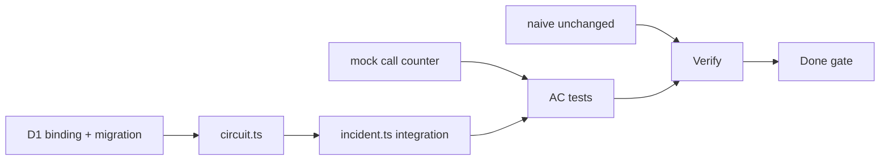

# Phase 2 — Tasks

> **Spec:** [`spec.md`](./spec.md)  
> **Prerequisite:** Phase 1 complete (`npm run test:phase-1` passes)  
> **Order:** Top to bottom. Check off as completed during implementation.

---

## 0. Prerequisites

### Resolved decisions (locked)

| Decision | Resolution |
|----------|------------|
| Scope | **Circuit breakers only** — no `audit_logs` / `waitUntil` |
| Circuit granularity | **Per origin** |
| D1 binding | **`DB`** |
| States | `closed`, `open`, `half_open` |
| Trip | **3 consecutive failures** (`CIRCUIT_FAILURE_THRESHOLD`) |
| Open cooldown | **30s** → `half_open` (`CIRCUIT_OPEN_SECONDS`) |
| Open + no fresh KV | Skip fetch, `null` slice, `X-Circuits-Open` |
| Open + fresh KV | Serve cache; no fetch |
| Naive route | **No** D1 / circuit logic |
| Mock verification | **`X-Mock-Call-Count`** on mock handlers |

- [ ] **T0.1** Confirm Phase 1 tests pass: `npm run test:phase-1`.
- [ ] **T0.2** Confirm Phase 0 tests pass: `npm run test:phase-0`.

---

## 1. D1 binding and migration

- [ ] **T1.1** Create `migrations/0001_circuit_state.sql` per spec (`circuit_state` table only).
- [ ] **T1.2** Add `[[d1_databases]]` binding `DB` to `wrangler.toml` with `migrations_dir = "migrations"`.
- [ ] **T1.3** Extend `Env` in `worker-configuration.d.ts`: `DB: D1Database`, optional `CIRCUIT_FAILURE_THRESHOLD`, `CIRCUIT_OPEN_SECONDS`.
- [ ] **T1.4** Verify Vitest pool applies migration (local D1 emulation).

---

## 2. Circuit module (`src/lib/circuit.ts`)

- [ ] **T2.1** Define `CircuitState` type: `closed` | `open` | `half_open`.
- [ ] **T2.2** Implement `failureThreshold(env)` and `openSeconds(env)` with spec defaults.
- [ ] **T2.3** Implement `getEffectiveState(env, origin)` — read D1; lazy `open` → `half_open` after cooldown.
- [ ] **T2.4** Implement `shouldSkipFetch(env, origin)` — `true` when effective state is `open`.
- [ ] **T2.5** Implement `recordSuccess(env, origin)` — `closed`, `failure_count = 0`.
- [ ] **T2.6** Implement `recordFailure(env, origin)` — increment count; trip to `open` at threshold.

---

## 3. Integrate into smart handler (`src/handlers/incident.ts`)

- [ ] **T3.1** After KV miss/expired, call `shouldSkipFetch` before fetch.
- [ ] **T3.2** On skip: return `null`, track origin for `X-Circuits-Open` (no subrequest increment).
- [ ] **T3.3** On fetch success: `recordSuccess` after `putSlice`.
- [ ] **T3.4** On fetch failure: `recordFailure` before returning `null`.
- [ ] **T3.5** Set `X-Circuits-Open` header when any origin skipped; omit when empty.
- [ ] **T3.6** Preserve Phase 1 behavior: `X-Subrequests-Used`, `X-Degraded`, merge, 503 `no_data`.

---

## 4. Mock call counter (`src/handlers/mock/`)

- [ ] **T4.1** Add per-origin module-level call counters (or shared helper in `src/lib/`).
- [ ] **T4.2** Set **`X-Mock-Call-Count`** on every mock response.
- [ ] **T4.3** Export `getMockCallCount(origin)` (or read header in tests) for AC-2 verification.

---

## 5. Naive route and router

- [ ] **T5.1** Confirm `incident-naive.ts` has **no** imports from `circuit.ts` or D1.
- [ ] **T5.2** Confirm router order unchanged: `/naive` before bare `/incident/:id`.

---

## 6. Phase 2 acceptance tests

Create `tests/phase-2/` mirroring Phase 1 structure.

- [ ] **T6.1** `helpers.ts` — same pattern as Phase 1 (`workerFetch`, `workerJson`).
- [ ] **T6.2** `ac.test.ts` — AC-1 (happy path regression).
- [ ] **T6.3** `ac-circuit.test.ts` — AC-2, AC-3, AC-4, AC-5 (isolated file for D1/circuit state).
- [ ] **T6.4** `ac-failures.test.ts` — AC-6 (naive regression).
- [ ] **T6.5** Add `npm run test:phase-2` to `package.json`.
- [ ] **T6.6** Optional `verify.md` with curl examples for circuit behavior.

---

## 7. Verification

- [ ] **T7.1** `npm run test:phase-2` — all AC rows pass.
- [ ] **T7.2** `npm run test:phase-1` — no regressions.
- [ ] **T7.3** `npm run test:phase-0` — no regressions.
- [ ] **T7.4** `npm run typecheck` passes.
- [ ] **T7.5** Manual: trip tickets circuit → 4th smart request skips tickets fetch; naive still 502 on tickets 500.

---

## 8. Phase 2 done checklist

- [ ] **T8.1** `DB` D1 binding present; **no** Queue bindings.
- [ ] **T8.2** No `audit_logs` table, `queue/`, or `waitUntil` audit code.
- [ ] **T8.3** Circuit logic only on smart route; KV key format unchanged.
- [ ] **T8.4** `X-Circuits-Open` implemented per spec.
- [ ] **T8.5** Update [README.md](../../README.md) status table when Phase 2 implementation is complete.
- [ ] **T8.6** Ready for Phase 3 spec (queues + stale-while-revalidate).

---

## Dependency graph

---

## Out of scope reminder

Do **not** implement during Phase 2:

- `audit_logs` / `waitUntil` request logging
- Queues, cron, background metrics refresh
- Stale-while-revalidate (expired KV on 429)
- Circuit breaker on `/incident/:id/naive`
- `eval/run-eval.ts`
- Changes to KV key format or slice field names
