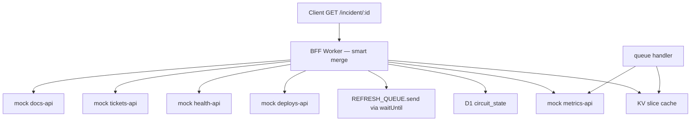
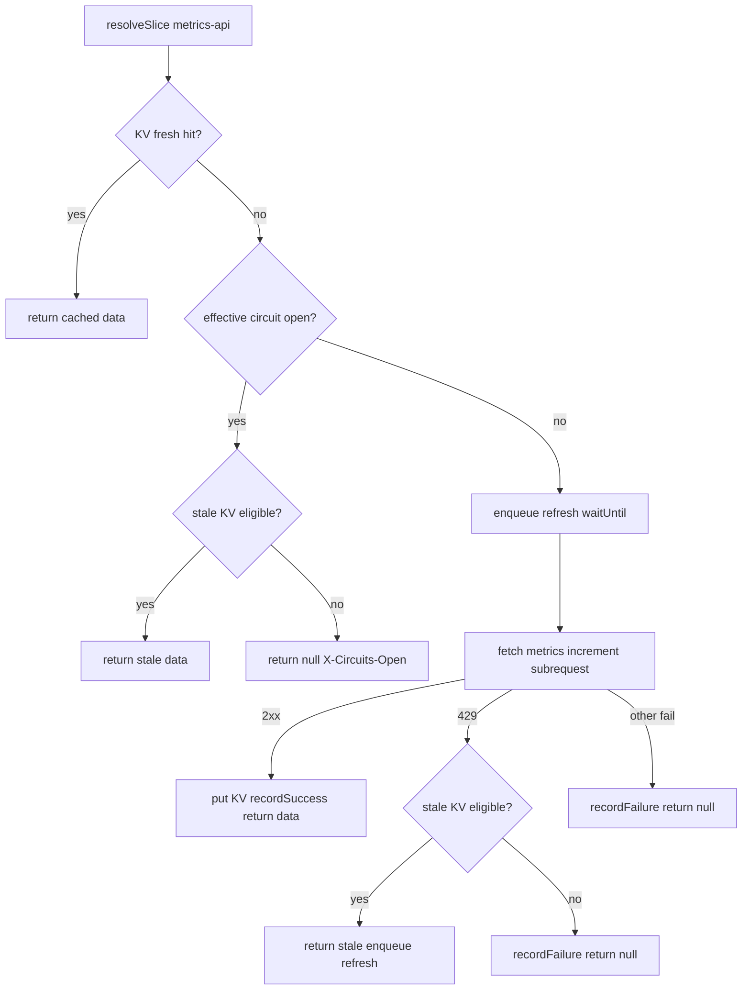

# Phase 3 — Queue-paced refresh + stale-while-revalidate

> **Status:** Ready for implementation  
> **Parent spec:** [`master-plan.md`](../../master-plan.md) (full internal plan; local, gitignored). Public overview: [`README.md`](../../README.md).  
> **Prerequisite:** Phase 2 complete (D1 circuit breakers; `npm run test:phase-2` passes)  
> **Goal:** Decouple user-facing latency from the rate-limited `metrics-api` — background queue refresh warms KV; smart route serves **stale** metrics under 429 instead of `null`.

---

## Purpose

Phase 3 addresses the **metrics rate-limit / thundering herd** problem left open in Phase 1:

- Phase 1 AC-4 returns `metrics: null` when `metrics-api` returns **429** — the dashboard loses error-rate data during incident load.
- Many clients refreshing the same incident can synchronize load on a capped upstream with no shared background ingest.

Phase 3 adds:

- **Stale-while-revalidate (SWR)** for `metrics-api` only — serve expired KV within a stale window when fetch fails with **429** (or when circuit is open and stale KV exists).
- **Queue-paced background refresh** — enqueue metrics refresh jobs on cache miss and on 429; consumer fetches at a controlled batch rate and writes fresh slices to KV.
- **`X-Stale-Slices`** header — observability for which origins were served from expired KV.

**Litmus check:** Phase 3 should sound like “serve stale metrics under rate limit with queue-paced background refresh,” not yet “cross-phase eval harness or audit logs.” That is Phase 4+.

**Naive route unchanged** — no SWR, no queue, still **502** on metrics 429.

---

## Scope

### In scope

| Area | Phase 3 behavior |
|------|------------------|
| Stale-while-revalidate | **`metrics-api` only** — serve expired KV within `STALE_MAX_SECONDS` |
| Queue producer | `REFRESH_QUEUE` binding; enqueue on metrics cache miss and on 429 |
| Queue consumer | `queue()` handler; batch fetch metrics, `putSlice` on 2xx |
| Smart route integration | Updated `resolveSlice` for metrics SWR; pass `ExecutionContext` |
| `degraded` semantics | `true` when any slice is `null` **or** any slice is stale |
| Header | `X-Stale-Slices` — comma-separated origins served from expired KV |
| AC tests | `tests/phase-3/*.test.ts` mapped to AC table below |
| Phase 1 AC-4 update | `ac-metrics-rate.test.ts` expects stale metrics non-null when warm-then-rate-limited |

### Out of scope (defer to later phases)

| Feature | Phase |
|---------|-------|
| SWR for non-metrics origins | — (metrics-only in Phase 3) |
| `audit_logs` table / `waitUntil` request telemetry | 4+ |
| `eval/` harness + CI regression gate | 4 |
| Auth, ADRs, deploy metrics | 4–5 |
| Circuit breaker on naive route | — (never) |
| Queue refresh for deploys/health/tickets/docs | — (metrics-only) |

**Explicit:** Phase 3 adds **Queues** only — no new D1 tables. Phase 2 circuit breaker and Phase 1 KV key format are unchanged.

---

## Architecture (Phase 3)



### Request path (hot path)

1. Validate `incidentId`; auth if configured (unchanged).
2. For each origin, run updated `resolveSlice` (metrics branch includes SWR).
3. Merge slices; set `degraded: true` if any slice is `null` or stale.
4. Set headers: `X-Subrequests-Used`, `X-Degraded`, `X-Circuits-Open`, `X-Stale-Slices`.

### Background path (cold path)

1. On metrics cache miss (before fetch) or on metrics **429**, enqueue `{ origin: "metrics-api", incidentId }` via `ctx.waitUntil(REFRESH_QUEUE.send(...))`.
2. Queue consumer receives batched messages; fetches `metrics-api` via `SELF`; on 2xx writes fresh KV slice.
3. Batch size tuned to `METRICS_RATE_LIMIT` (default **10** per 60s rolling window on mock).

Pattern: [Handle rate limits of external APIs](https://developers.cloudflare.com/queues/tutorials/handle-rate-limits/).

---

## Updated `resolveSlice` flow

Phase 2 flow preserved for non-metrics origins. **Metrics-api** branch extended as below.

### Non-metrics origins (unchanged from Phase 2)

1. **Fresh KV** → return cached data.
2. **Circuit open** → return `null`, list in `X-Circuits-Open`; no fetch.
3. **Fetch** (closed/half_open) → increment subrequest.
4. **2xx** → `putSlice`, `recordSuccess`, return data.
5. **Failure** → `recordFailure`, return `null`.

### Metrics-api branch (Phase 3)

1. **Fresh KV** → return cached data (unchanged).
2. **Circuit open** → try **stale KV** (`getStaleSlice`); if hit → return stale data (mark stale, **not** in `X-Circuits-Open`); else skip fetch, `null`, list in `X-Circuits-Open`.
3. **Cache miss/expired** → enqueue refresh via `waitUntil` **before** fetch.
4. **Fetch** (closed/half_open) → increment subrequest.
5. **2xx** → `putSlice`, `recordSuccess`, return data.
6. **429** → `recordFailure`; try **stale KV** → if hit, return stale + enqueue refresh; else `null`.
7. **Other failure** (non-429) → `recordFailure`, return `null`.



---

## HTTP routes

| Method | Path | Handler | Phase 3 change |
|--------|------|---------|----------------|
| `GET` | `/incident/:incidentId` | Smart merge | SWR for metrics; enqueue on miss/429 |
| `GET` | `/incident/:incidentId/naive` | Naive merge | **Unchanged** — no SWR, no queue |
| `GET` | `/mock/{origin}/:incidentId` | Mock upstream | Unchanged |
| `GET` | `/health` | Health | Unchanged |
| *(queue)* | `REFRESH_QUEUE` | Queue consumer | **New** — `queue()` export on Worker |

---

## Stale-while-revalidate

### Fresh vs stale vs missing (Phase 3 — metrics-api)

| State | Condition | Behavior |
|-------|-----------|----------|
| **Fresh** | `cachedAt + ttlSeconds > now` | Serve `data`; no fetch; subrequest unchanged |
| **Stale eligible** | Entry exists, TTL expired, `now - cachedAt <= STALE_MAX_SECONDS` | Serve on **429** or when circuit **open** (metrics only) |
| **Stale expired** | Entry exists but beyond stale window | Treat as miss — fetch or `null` |
| **Miss** | No KV entry | Fetch; enqueue refresh on metrics miss |

Non-metrics origins: Phase 1–2 rules unchanged — expired KV is a miss; failure → `null`.

### Stale window defaults

| Setting | Default | Env override |
|---------|---------|--------------|
| Stale max age | **300** seconds | `STALE_MAX_SECONDS` (global) or `METRICS_STALE_MAX_SECONDS` (metrics override) |

Stale eligibility: entry exists, `cachedAt + ttlSeconds <= now`, and `now - cachedAt <= staleMaxSeconds(origin)`.

### `degraded` semantics

- `degraded: false` — all five slices non-null **and** none served stale.
- `degraded: true` — any slice is `null` **or** any slice was served from stale KV.

Stale slices are **non-null** in the JSON body (same shape as fresh data).

---

## Queue — producer and consumer

### Message type

```typescript
interface RefreshMessage {
  origin: "metrics-api";
  incidentId: string;
}
```

### Binding (`wrangler.toml`)

```toml
[[queues.producers]]
binding = "REFRESH_QUEUE"
queue = "incident-bff-refresh"

[[queues.consumers]]
queue = "incident-bff-refresh"
max_batch_size = 10
max_batch_timeout = 5
max_retries = 3
```

- `max_batch_size` — default **10**, aligned with `METRICS_RATE_LIMIT` (10 req / 60s rolling window on mock).
- `max_batch_timeout` — **5** seconds; collect messages before processing partial batch.

Vitest pool workers emulate Queues via the same `wrangler.toml` binding.

### Producer (`enqueueMetricsRefresh`)

| Trigger | When |
|---------|------|
| Cache miss | Metrics KV miss or expired (before fetch attempt) |
| 429 response | After `recordFailure` on metrics 429 (alongside stale serve if eligible) |

Implementation: `ctx.waitUntil(env.REFRESH_QUEUE.send({ origin: "metrics-api", incidentId }))`.

`handleIncident` and `resolveSlice` must receive `ExecutionContext` from the router.

### Consumer (`src/queue/refresh.ts`)

For each message in batch:

1. Fetch `metrics-api` via `SELF` / `buildMockUrl` (no incoming request headers required; use env defaults).
2. On **2xx** → `putSlice` with `ttlForOrigin(env, "metrics-api")`; `message.ack()`.
3. On failure → `message.retry({ delaySeconds: 5 })` (or `ack` after max retries per queue config).

Wire `queue(batch, env, ctx)` in `src/index.ts` → delegate to `handleRefreshQueue`.

### Module API

| Module | Function | Role |
|--------|----------|------|
| `src/lib/cache.ts` | `getStaleSlice(env, origin, incidentId)` | Return `data` if stale-eligible, else `null` |
| `src/lib/cache.ts` | `staleMaxSeconds(env, origin)` | Stale window for origin (metrics default 300) |
| `src/lib/refresh-queue.ts` | `enqueueMetricsRefresh(ctx, env, incidentId)` | `waitUntil` + `REFRESH_QUEUE.send` |
| `src/queue/refresh.ts` | `handleRefreshQueue(batch, env)` | Consumer batch processing |

---

## Fetch status detection (metrics 429)

Extend `fetchOriginJson` or add `fetchOriginResult` to distinguish **429** from other failures for metrics SWR branch:

```typescript
// Example return shape for metrics path
{ ok: true, data } | { ok: false, status: 429 } | { ok: false }
```

Only the metrics `resolveSlice` branch uses 429-specific stale fallback.

---

## Response headers (smart route)

Phase 1–2 headers preserved:

| Header | When | Value |
|--------|------|-------|
| `X-Subrequests-Used` | Always | Origin fetches only; open-circuit skips excluded |
| `X-Degraded` | `degraded: true` | `true` |
| `X-Circuits-Open` | Origins skipped (open circuit, no fresh or stale KV) | Comma-separated list |
| `X-Stale-Slices` | One or more slices served from stale KV | Comma-separated list, e.g. `metrics-api` |

Omit `X-Stale-Slices` when no stale slices were served.

**Precedence (metrics, circuit open):**

| KV state | Result | `X-Circuits-Open` | `X-Stale-Slices` |
|----------|--------|-------------------|------------------|
| Fresh hit | Serve fresh | omit | omit |
| Stale eligible | Serve stale, `degraded: true` | omit | `metrics-api` |
| No eligible KV | `null`, skip fetch | `metrics-api` | omit |

---

## Merge integration

Extend per-origin result passed to `mergeSlices`:

```typescript
interface OriginSliceResult {
  origin: OriginId;
  slice: unknown | null;
  stale?: boolean;  // true when slice came from getStaleSlice
}
```

`mergeSlices` sets `degraded: true` when any slice is `null` or any `stale: true`.

---

## Environment variables

Phase 0–2 vars unchanged. Phase 3 additions:

| Variable | Default | Purpose |
|----------|---------|---------|
| `STALE_MAX_SECONDS` | `300` | Global stale window (seconds after `cachedAt`) |
| `METRICS_STALE_MAX_SECONDS` | *(falls back to `STALE_MAX_SECONDS`)* | Metrics-specific stale override |

Queue binding `REFRESH_QUEUE` is a Wrangler binding, not an env var.

---

## Files to add or change

```
/
├── wrangler.toml                          # add queues producer + consumer
├── worker-configuration.d.ts              # REFRESH_QUEUE: Queue<RefreshMessage>
├── package.json                           # test:phase-3 script
├── src/
│   ├── index.ts                           # pass ctx to handleIncident; export queue()
│   ├── handlers/
│   │   ├── incident.ts                    # SWR, stale tracking, enqueue, X-Stale-Slices
│   │   └── incident-naive.ts              # unchanged
│   ├── lib/
│   │   ├── cache.ts                       # getStaleSlice, staleMaxSeconds
│   │   ├── refresh-queue.ts               # RefreshMessage type, enqueueMetricsRefresh
│   │   ├── merge.ts                       # stale flag in degraded derivation
│   │   └── upstream-fetch.ts              # optional 429 status for metrics path
│   └── queue/
│       └── refresh.ts                     # handleRefreshQueue consumer
├── tests/
│   └── phase-3/
│       ├── helpers.ts
│       ├── ac.test.ts
│       ├── ac-stale.test.ts
│       ├── ac-queue.test.ts
│       └── ac-failures.test.ts
└── spec-driven/
    └── phase-3/
        ├── spec.md                        # this file
        └── tasks.md
```

**Also update during implementation:**

- `tests/phase-1/ac-metrics-rate.test.ts` — AC-4 expects `metrics` non-null (stale) after warm + rate-limit burst.

**Not created Phase 3:** `audit_logs` migration, `eval/`, SWR for non-metrics origins.

---

## Acceptance criteria

Automated tests in `tests/phase-3/*.test.ts` (run via `npm run test:phase-3`). Phase 0–2 suites must still pass after Phase 1 AC-4 update.

Use **distinct `incidentId`s per test** to avoid KV/circuit/queue cross-test pollution. Isolate stale tests in `ac-stale.test.ts`; queue tests in `ac-queue.test.ts`.

Queue tests may use `createMessageBatch`, `getQueueResult`, and `waitOnExecutionContext` from `cloudflare:test`.

| # | Scenario | Expected | Test file |
|---|----------|----------|-----------|
| AC-1 | Happy path (`TICKETS_MODE=ok`, cold cache) | **200**, all slices non-null, `degraded: false`, no `X-Stale-Slices` | `ac.test.ts` |
| AC-2 | Warm metrics KV → wait for TTL expiry → burst past rate limit → smart request | **200**, `metrics` **non-null** (stale), `degraded: true`, `X-Stale-Slices: metrics-api` | `ac-stale.test.ts` |
| AC-3 | Open metrics circuit after 429 trips + stale KV present | `metrics` non-null from stale; **not** in `X-Circuits-Open`; no metrics subrequest on that request | `ac-stale.test.ts` |
| AC-4 | Stale serve does not block other origins | Other four slices present; `X-Subrequests-Used` reflects non-metrics fetches only when circuit skips metrics | `ac-stale.test.ts` |
| AC-5 | Queue consumer refreshes KV | `REFRESH_QUEUE.send` or `createMessageBatch` → consumer runs → KV contains fresh metrics slice | `ac-queue.test.ts` |
| AC-6 | Metrics cache miss enqueues refresh | Smart cold request for metrics → `waitOnExecutionContext` → background metrics fetch occurs (KV warmed or mock call count increases) | `ac-queue.test.ts` |
| AC-7 | Naive regression | `/incident/:id/naive` with metrics rate-limited still **502**; no stale serve | `ac-failures.test.ts` |
| AC-8 | Phase 0–2 regression | `npm run test:phase-0`, `test:phase-1`, `test:phase-2` pass (includes updated Phase 1 AC-4) | tasks verification |

### Phase 1 AC-4 superseded

| Before (Phase 1) | After (Phase 3) |
|------------------|-----------------|
| Smart route **200**, `metrics: null`, `degraded: true` on rate limit (cold) | After warm + TTL expiry + rate limit: **200**, `metrics` **non-null** (stale), `degraded: true`, `X-Stale-Slices: metrics-api` |
| Naive still **502** | Unchanged |

Cold cache with no prior metrics KV still yields `metrics: null` until queue consumer or a successful fetch populates KV.

---

## Resolved decisions

| Decision | Resolution |
|----------|------------|
| SWR scope | **`metrics-api` only** |
| Stale eligibility | Expired TTL but within **`STALE_MAX_SECONDS`** (default 300) of `cachedAt` |
| Stale on 429 | Serve stale if eligible; `recordFailure` still runs |
| Open circuit + stale KV | Serve stale; omit from `X-Circuits-Open`; include in `X-Stale-Slices` |
| `degraded` | `true` when any `null` slice **or** any stale slice |
| Queue binding | **`REFRESH_QUEUE`** (producer + consumer, same Worker) |
| Message body | `{ origin: "metrics-api", incidentId }` |
| Enqueue triggers | Metrics cache miss; metrics **429** |
| Enqueue mechanism | `ctx.waitUntil(REFRESH_QUEUE.send(...))` |
| Consumer batch size | **`METRICS_RATE_LIMIT`** default (10) |
| Naive route | **No** SWR, **no** queue |
| Phase 1 AC-4 | **Update** to expect stale metrics when warm-then-rate-limited |
| Audit logs | **Deferred** (Phase 4+) |

---

## References

- [Phase 2 spec](../phase-2/spec.md)
- [Phase 1 spec](../phase-1/spec.md) — KV format, partial merge
- [master-plan — Phase 3](../../master-plan.md#implementation-phases)
- [master-plan — Background path](../../master-plan.md#request-path-hot-path)
- [Queues: handle rate limits](https://developers.cloudflare.com/queues/tutorials/handle-rate-limits/)
- [Vitest pool — Queue test APIs](https://developers.cloudflare.com/workers/testing/vitest-integration/test-apis/)
