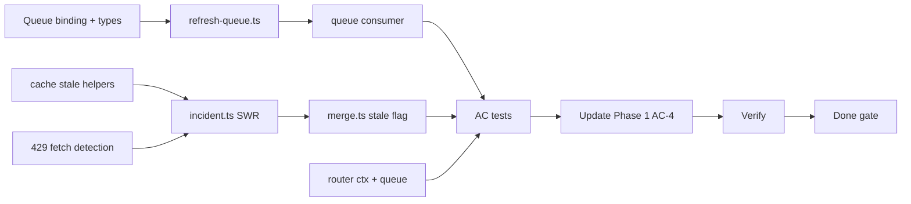

# Phase 3 — Tasks

> **Spec:** [`spec.md`](./spec.md)  
> **Prerequisite:** Phase 2 complete (`npm run test:phase-2` passes)  
> **Order:** Top to bottom. Check off as completed during implementation.

---

## 0. Prerequisites

### Resolved decisions (locked)

| Decision | Resolution |
|----------|------------|
| Scope | **Queues + metrics SWR only** — no `audit_logs` |
| SWR scope | **`metrics-api` only** |
| Stale window | **`STALE_MAX_SECONDS`** default 300 |
| Stale on 429 | Serve stale if eligible; **`recordFailure` still runs** |
| Open circuit + stale | Serve stale; **not** in `X-Circuits-Open`; **in** `X-Stale-Slices` |
| `degraded` | `true` when any `null` **or** any stale slice |
| Queue binding | **`REFRESH_QUEUE`** (producer + consumer) |
| Enqueue | Metrics cache miss + metrics **429** via `ctx.waitUntil` |
| Consumer batch | `max_batch_size` = **`METRICS_RATE_LIMIT`** (10) |
| Naive route | **No** SWR, **no** queue |
| Phase 1 AC-4 | **Update** for stale metrics when warm-then-rate-limited |

- [ ] **T0.1** Confirm Phase 2 tests pass: `npm run test:phase-2`.
- [ ] **T0.2** Confirm Phase 1 tests pass: `npm run test:phase-1`.
- [ ] **T0.3** Confirm Phase 0 tests pass: `npm run test:phase-0`.

---

## 1. Queue binding and types

- [ ] **T1.1** Add `[[queues.producers]]` and `[[queues.consumers]]` for `REFRESH_QUEUE` / `incident-bff-refresh` to `wrangler.toml`.
- [ ] **T1.2** Set `max_batch_size = 10`, `max_batch_timeout = 5`, `max_retries = 3` on consumer.
- [ ] **T1.3** Extend `Env` in `worker-configuration.d.ts`: `REFRESH_QUEUE: Queue<RefreshMessage>`.
- [ ] **T1.4** Add optional env vars: `STALE_MAX_SECONDS`, `METRICS_STALE_MAX_SECONDS`.

---

## 2. Cache stale helpers (`src/lib/cache.ts`)

- [ ] **T2.1** Implement `staleMaxSeconds(env, origin)` — default 300 for `metrics-api`.
- [ ] **T2.2** Implement `getStaleSlice(env, origin, incidentId)` — return `data` if entry exists, TTL expired, within stale window; else `null`.
- [ ] **T2.3** Keep `getFreshSlice` unchanged (fresh-only semantics).

---

## 3. Refresh queue module (`src/lib/refresh-queue.ts`)

- [ ] **T3.1** Define `RefreshMessage` type: `{ origin: "metrics-api"; incidentId: string }`.
- [ ] **T3.2** Implement `enqueueMetricsRefresh(ctx, env, incidentId)` — `ctx.waitUntil(env.REFRESH_QUEUE.send(...))`.
- [ ] **T3.3** Export type for `worker-configuration.d.ts` / consumer use.

---

## 4. Queue consumer (`src/queue/refresh.ts`)

- [ ] **T4.1** Implement `handleRefreshQueue(batch, env)` — iterate messages, fetch metrics via `SELF`.
- [ ] **T4.2** On 2xx → `putSlice`, `message.ack()`.
- [ ] **T4.3** On failure → `message.retry({ delaySeconds: 5 })`.
- [ ] **T4.4** Wire `queue(batch, env, ctx)` export in `src/index.ts`.

---

## 5. Upstream fetch — 429 detection (optional refactor)

- [ ] **T5.1** Extend `fetchOriginJson` or add `fetchOriginWithStatus` to return `{ ok: false, status: 429 }` for metrics SWR branch.
- [ ] **T5.2** Non-metrics paths unchanged (any failure → `null`).

---

## 6. Smart handler (`src/handlers/incident.ts`)

- [ ] **T6.1** Add `ctx: ExecutionContext` parameter to `handleIncident`.
- [ ] **T6.2** Metrics branch: on cache miss/expired, call `enqueueMetricsRefresh` before fetch.
- [ ] **T6.3** Metrics branch: circuit open → try `getStaleSlice` before skip/null.
- [ ] **T6.4** Metrics branch: on **429** → `recordFailure`, try stale, enqueue refresh if stale served or on 429.
- [ ] **T6.5** Track `stale: boolean` per origin; collect origins for `X-Stale-Slices`.
- [ ] **T6.6** Set `X-Stale-Slices` header when any stale slice served; omit when empty.
- [ ] **T6.7** Pass stale flags into `mergeSlices` for `degraded` derivation.
- [ ] **T6.8** Preserve Phase 2 behavior: `X-Circuits-Open`, `X-Subrequests-Used`, 503 `no_data`.

---

## 7. Merge module (`src/lib/merge.ts`)

- [ ] **T7.1** Extend `OriginSliceResult` with optional `stale?: boolean`.
- [ ] **T7.2** Update `mergeSlices` — `degraded: true` when any slice `null` or any `stale: true`.

---

## 8. Router (`src/index.ts`)

- [ ] **T8.1** Pass `ctx` from `fetch` handler to `handleIncident`.
- [ ] **T8.2** Export `queue()` handler delegating to `handleRefreshQueue`.
- [ ] **T8.3** Confirm `/naive` route unchanged.

---

## 9. Naive route

- [ ] **T9.1** Confirm `incident-naive.ts` has **no** imports from `refresh-queue`, `getStaleSlice`, or queue bindings.
- [ ] **T9.2** Confirm naive still returns **502** on metrics 429.

---

## 10. Phase 3 acceptance tests

Create `tests/phase-3/` mirroring Phase 2 structure.

- [ ] **T10.1** `helpers.ts` — extend Phase 2 helpers; optional `queueBatch` / `getQueueResult` wrappers.
- [ ] **T10.2** `ac.test.ts` — AC-1 (happy path regression).
- [ ] **T10.3** `ac-stale.test.ts` — AC-2, AC-3, AC-4 (isolated file for KV TTL + rate limit state).
- [ ] **T10.4** `ac-queue.test.ts` — AC-5, AC-6 (queue consumer + enqueue on miss).
- [ ] **T10.5** `ac-failures.test.ts` — AC-7 (naive regression).
- [ ] **T10.6** Add `npm run test:phase-3` to `package.json`.

---

## 11. Update Phase 1 AC-4

- [ ] **T11.1** Update `tests/phase-1/ac-metrics-rate.test.ts` — warm metrics KV, wait for TTL expiry, burst rate limit, assert `metrics` non-null (stale), `X-Stale-Slices: metrics-api`.
- [ ] **T11.2** Keep naive **502** assertion unchanged.

---

## 12. Verification

- [ ] **T12.1** `npm run test:phase-3` — all AC rows pass.
- [ ] **T12.2** `npm run test:phase-2` — no regressions.
- [ ] **T12.3** `npm run test:phase-1` — passes with updated AC-4.
- [ ] **T12.4** `npm run test:phase-0` — no regressions.
- [ ] **T12.5** `npm run typecheck` passes.
- [ ] **T12.6** Manual: warm metrics → expire TTL → rate limit → smart route returns stale metrics with `degraded: true`.

---

## 13. Phase 3 done checklist

- [ ] **T13.1** `REFRESH_QUEUE` binding present; consumer `queue()` wired.
- [ ] **T13.2** SWR **metrics-api only**; other origins unchanged.
- [ ] **T13.3** No `audit_logs` table or audit `waitUntil` logging.
- [ ] **T13.4** `X-Stale-Slices` implemented per spec.
- [ ] **T13.5** KV key format unchanged (`cache:{origin}:{incidentId}`).
- [ ] **T13.6** Update [README.md](../../README.md) status table when Phase 3 implementation is complete.
- [ ] **T13.7** Ready for Phase 4 spec (`eval/` harness).

---

## Dependency graph

---

## Out of scope reminder

Do **not** implement during Phase 3:

- `audit_logs` / request audit telemetry
- SWR for deploys, health, tickets, or docs
- `eval/run-eval.ts` or CI eval gate
- Circuit breaker or SWR on `/incident/:id/naive`
- Changes to D1 schema or KV key format
- Cron triggers (queue enqueue on request path only)
